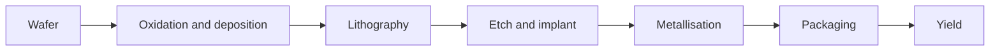

# Level 12 -- Semiconductor Fabrication

Wafer preparation, oxidation, deposition, lithography, etch, implantation, metallisation, packaging, and yield, through process models and simulation.

> [!WARNING]
> This level is not a home chemistry project. Study it through models, simulators, and supervised teaching facilities only.

## What this level covers

- Silicon wafers: crystal orientation, growth, and preparation
- Thermal oxidation and thin-film deposition
- Photolithography: masks, alignment, and the resolution limits
- Wet and dry etching, and the difference in what each removes
- Doping: ion implantation and diffusion
- Metallisation, interconnect, and packaging
- Yield: how defects become dollars

## Concepts

- Process flow from bare wafer to packaged die
- How each step shapes the devices from Level 11
- Yield as a function of defect density
- The process limits hidden inside the PDK that Level 10 treats as a given

## The flow, simplified

## Common mistakes

- Treating the process flow as a reversible checklist instead of a sequence of trade-offs
- Ignoring yield until "fabrication" feels like a physics exercise that happened to a whole wafer
- Expecting a simulator to model a step it was never given the chemistry for
- Skipping the safety layer because the model made this step look clean

## Where to go from here

- [Level 13](../13-advanced-hardware/README.md) if you want to reproduce or write up process work yourself.
- The [OpenLane Sky130 flow](../../lessons/30-openlane-sky130-flow/README.md) to see fabrication constraints appear in a real PDK.

## Resources

- [Simulation](../../resources/simulation.md) for process simulation tools.
- [Help](../../resources/help.md) for finding supervised facilities and people doing this safely.