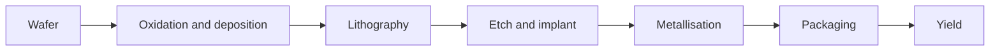
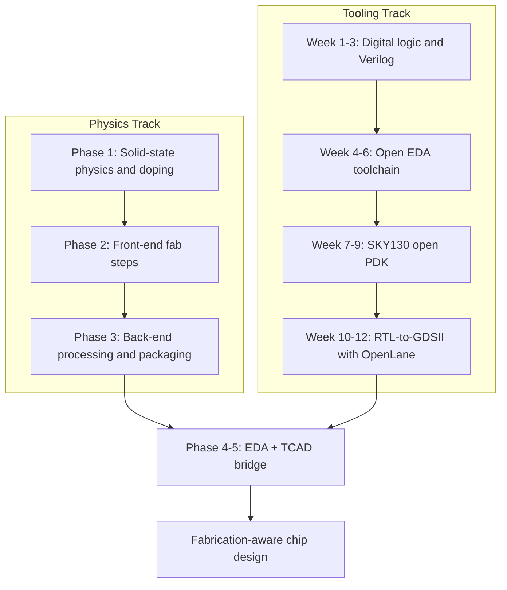

# Level 12 -- Semiconductor Fabrication

Wafer preparation, oxidation, deposition, lithography, etch, implantation, metallisation, packaging, and yield, through process models and simulation.

> [!WARNING]
> This level is not a home chemistry project. Study it through models, simulators, and supervised teaching facilities only.

## Prerequisites

[Level 11](../11-semiconductor-devices/README.md) for the devices you will now watch being built, and a completed pass at [Level 10](../10-asic-design/README.md) so the PDK you ran there stops looking like a black box. The physics track and the tooling track below cover the remainders of AICTE's EC01 fabrication unit and the *VLSI Design* flow from EC24 side by side.

## Core concepts

- Silicon wafers: crystal orientation, growth, and preparation
- Thermal oxidation and thin-film deposition
- Photolithography: masks, alignment, and the resolution limits
- Wet and dry etching, and the difference in what each removes
- Doping: ion implantation and diffusion
- Metallisation, interconnect, and packaging
- Yield: how defects become dollars

The syllabus's *Integrated circuit fabrication process* (oxidation, diffusion, ion implantation, photolithography, etching, chemical vapour deposition, sputtering, twin-tub CMOS process) is the checklist this level walks. The twin-tub CMOS recipe is worth singling out: it is the concrete sequence, two complementary wells, that the standard-cell layout you ran in Level 10 is built on. The [MEMS](https://www.aicte.gov.in/sites/default/files/Final_ECE.pdf) and *Nanoelectronics* electives in the same curriculum are where the process steps here go exotic.

## Lessons

| # | Lesson | What it builds |
|---|---|---|
| 30 | [OpenLane Sky130 flow](../../lessons/30-openlane-sky130-flow/README.md) | Run a real RTL-to-GDSII flow against the process this level describes |

Track B below is the fuller lab sequence; lesson 30 is its capstone.

## The flow, simplified

---

## Coursework: Zero to Nanofab

Two ways into this material, and they teach different things. Neither one alone gets you there.

- **The physics track** explains *why* each fab step exists: band theory, doping, thin-film chemistry, plasma etching. You cannot safely reason about a process step you do not understand physically.
- **The tooling track** gives you *hands-on distance*: open-source EDA tools and an open PDK let you run a real RTL-to-GDSII flow on your own machine, without a cleanroom.

> [!TIP]
> Run both tracks in parallel rather than finishing one before starting the other. The tooling track makes the physics concrete; the physics track keeps the tooling from feeling like magic.

### Track A: Physics and process foundations

| Phase | Focus | Verification checkpoint |
|---|---|---|
| 1. Core foundations | Solid-state physics, conductors vs. insulators vs. semiconductors, intrinsic and extrinsic silicon, p-type/n-type doping | Can you explain the bandgap difference between an insulator and a semiconductor, and what happens at a p-n junction under forward bias? |
| 2. Front-end fabrication (FEOL) | Wafer prep (Czochralski growth, slicing), oxidation, photolithography, wet/dry etching, ion implantation, deposition (CVD/PVD) | Can you order the steps that build a single basic MOSFET on a silicon substrate? |
| 3. Back-end processing (BEOL) and packaging | Metallisation, wafer-level electrical test (EDS), dicing, packaging | Can you describe the difference between FEOL and BEOL? |
| 4. EDA and chip design | Verilog/SystemVerilog, open-source flows (Yosys, OpenROAD, Magic) | Can you write a basic Verilog module for a 4-bit counter and simulate its waveform? |
| 5. Hands-on tools and academic frameworks | TCAD process simulation, process integration at modern nodes (3nm/2nm GAA vs. planar) | Have you set up an open-source VLSI design flow or explored a layout viewer like KLayout? |

> [!NOTE]
> Phases 1-3 are almost entirely conceptual at this level. You are learning to read and reason about a process, not to run it. Phases 4-5 are where you start producing artifacts, Verilog, layouts, simulation results, you can actually check.

### Track B: Open-source EDA and physical design

| Weeks | Focus | Verification checkpoint |
|---|---|---|
| 1-3 | Digital logic fundamentals: binary logic, Boolean algebra, how gates are built from transistors, first Verilog modules | Can you write and simulate a 4-bit multiplexer with Icarus Verilog (`iverilog`)? |
| 4-6 | Install an open-source EDA toolchain: Yosys (synthesis), Magic (layout viewing), Netgen (LVS) | Can you launch Magic and view a standard cell layout from an open PDK? |
| 7-9 | Explore the SkyWater SKY130 open PDK: design rules, metal layers, standard cell libraries | Can you run a DRC on a basic inverter layout in Magic and clear all errors? |
| 10-12 | Run an autonomous RTL-to-GDSII flow with OpenLane/OpenROAD: placement, routing, timing closure | Does your OpenLane run complete without routing or timing violations, producing a clean final GDSII? |

> [!IMPORTANT]
> Each week's verification checkpoint is a gate, not a suggestion. If you cannot clear it, go back into the datasheet, the PDK docs, or the tool's error log rather than moving forward and hoping it resolves itself.

## Essential resources for the coursework

| Resource | Type | Useful for |
|---|---|---|
| [OpenLane](https://github.com/The-OpenROAD-Project/OpenLane) / [OpenROAD](https://github.com/The-OpenROAD-Project/OpenROAD) documentation | Toolchain docs | The definitive guide for running an automated open-source flow from RTL to physical layout |
| [`google/skywater-pdk`](https://github.com/google/skywater-pdk) | Open PDK | The official open-source SKY130 process design kit: foundry rules, device models, layers |
| [Tiny Tapeout](https://tinytapeout.com/) | Educational shuttle program | Getting a small digital design onto a real multi-project wafer, cheaply or through open programs |
| [VLSI System Design (VSD)](https://www.vlsisystemdesign.com/) | Workshops | Bridging code to physical design using a fully free tool stack |
| NPTEL, *Fundamentals of Micro and Nanofabrication* (IISc Bangalore) — [playlist](https://www.youtube.com/watch?v=lW0QMvmeVGs&list=PLgMDNELGJ1CbHti4HN0BuagtoD06H78YT) | University course | Cleanroom-level depth on thin-film deposition, lithographic exposure limits, plasma etching chemistry, and contamination control |

> [!NOTE]
> The NPTEL series is university coursework co-developed by IISc/IIT faculty, not a summary video. Treat it as primary academic material and pace yourself accordingly. It pairs well with Track A: watch the matching lecture as you reach each physics phase rather than binging the whole series up front.

## Common mistakes

- Treating the process flow as a reversible checklist instead of a sequence of trade-offs
- Ignoring yield until "fabrication" feels like a physics exercise that happened to a whole wafer
- Expecting a simulator to model a step it was never given the chemistry for
- Skipping the safety layer because the model made this step look clean
- Running the tooling track to completion without ever opening the physics material; you will end up with a GDSII file and no idea why the DRC rules are shaped the way they are

## Resources

- [Simulation](../../resources/simulation.md) for process simulation tools.
- [Help](../../resources/help.md) for finding supervised facilities and people doing this safely.
- [Opportunities](../../opportunities/README.md) for process, physical-design, and fab-adjacent roles.

## Where to go from here

- [Level 13](../13-advanced-hardware/README.md) if you want to reproduce or write up process work yourself.
- The [OpenLane Sky130 flow](../../lessons/30-openlane-sky130-flow/README.md) to see fabrication constraints appear in a real PDK.
- Back to [Level 11](../11-semiconductor-devices/README.md) for the device physics each process step is building.