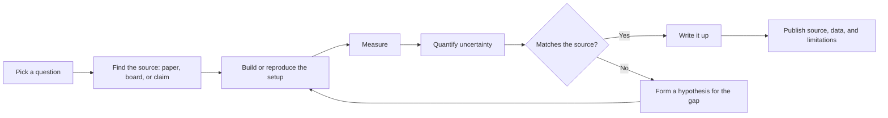

# Level 13 -- Advanced Hardware

Choose a research question, reproduce a paper's result, investigate open hardware, quantify uncertainty, and publish enough source, data, and limitations for someone else to check your work independently.

This level is not a project list. It is a way of working. The output is a written result that stands on its own, backed by data someone else can inspect.

> [!NOTE]
> There is no single correct workflow here. The diagram below is a loop, not a checklist expect to bounce backward when a measurement doesn't match what you expected.

## What this level covers

- Reproducing published results and documenting what differs
- Open hardware investigation and reverse engineering
- Uncertainty quantification in measurements
- Writing up findings that someone else can verify

## Ways to work at this level

| Direction | What it looks like | What it demands |
|---|---|---|
| Reproduce a paper | Take a published circuit, firmware technique, or measurement method and rebuild it from the write-up alone | Careful reading, tolerance for ambiguity in the original methods section |
| Reverse engineer open hardware | Trace a schematic from an open-source board, teardown, or leaked design and confirm it against observed behavior | Datasheet fluency, patience with incomplete documentation |
| Quantify uncertainty | Take a measurement you've made before and characterize its error: repeatability, instrument accuracy, environmental drift | Statistics basics, an honest accounting of what you don't know |
| Investigate a discrepancy | Something didn't match theory or a datasheet claim last time -- go find out why | A hypothesis, a controlled way to test it, willingness to be wrong |

## Reproducing a result: what to capture

A reproduction is only useful if the differences are visible. At minimum, record:

1. The original source (paper, application note, project writeup) and its exact claim
2. Your setup: hardware, instruments, firmware or software versions
3. What you changed from the original, deliberately or because you had no choice
4. Raw measurements, not just the summary numbers
5. Where your result matches, and where it diverges
6. Your best explanation for any divergence

> [!TIP]
> Keep the raw data. A summary table is easy to fake by accident through rounding or a bad average -- the raw numbers are what let someone else check your work.

## Quantifying uncertainty

Every measurement has error. At this level, that error should be visible instead of implied.

- State instrument accuracy from the datasheet, not an assumed "close enough"
- Repeat the measurement and report the spread, not a single reading
- Distinguish random noise from a systematic offset
- Report a result as a range or a value with an uncertainty, not a bare number

> [!WARNING]
> A **bare number with no error bar** is the single most common way a reproduction gets rejected by someone trying to verify it. If you can't state your confidence, you're not done measuring yet.

## Common mistakes

- Treating a single measurement as a settled result
- Reproducing a circuit but not the conditions (temperature, supply tolerance, load) that made the original result true
- Reporting a number without saying how confident you are in it
- Skipping the write-up because the result "didn't work" -- a documented failure is still a result
- Citing a blog's summary of a paper instead of the paper itself

> [!IMPORTANT]
> **Reproducibility is the deliverable, not the circuit.** If a stranger with the same parts and your write-up can't get within your stated uncertainty of your result, the work isn't finished yet.

## Where to go from here

There is no fixed next step. Some directions:

- **Go deeper.** Pick a branch from earlier levels and revisit it with more rigor.
- **Build something new.** Combine ideas from multiple levels into a project that does not exist yet.
- **Revisit failures.** The circuit that did not work the first time is often the most instructive one.
- **Contribute.** [Contribute a verified lesson](../../CONTRIBUTING.md) or a project back to Hardware Atlas.
- **Add a project.** The [`projects/`](../../projects/README.md) directory documents how to structure and submit a build that does not fit the numbered roadmap.

## Resources

- [Projects](../../projects/README.md) for how to structure your own project.
- [Help](../../resources/help.md) for communities and forums.
- [Contributing](../../CONTRIBUTING.md) for submission guidelines.