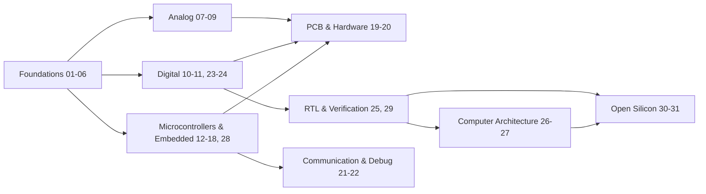

# Projects

The lessons in this repository are reference points, not a curriculum. Building electronics is not a linear game with one correct route. Someone interested in analog electronics might spend three weeks on a single filter circuit. Someone interested in embedded systems might jump straight from a basic microcontroller project into UART, I2C, RTOS, or PCB work. Someone interested in digital design might skip most of the beginner projects entirely and start from the RTL and computer architecture material.

Use the roadmap as a map, not a set of rules.

## The 31 projects
The shape of the roadmap is a branch, not a chain. Foundations feed into several independent directions, and nothing requires finishing one branch before starting another.

### Foundations

| # | Project | Main idea | Path |
|---|---|---|---|
| 01 | LED Circuit | First circuit, current limiting, Ohm's law in practice | [`lessons/01-led-circuit/`](../lessons/01-led-circuit/README.md) |
| 02 | Voltage Divider | Resistor ratios, loaded vs unloaded output | [`lessons/02-voltage-divider/`](../lessons/02-voltage-divider/README.md) |
| 03 | Button and LED | Digital input, pull-up/pull-down basics | [`lessons/03-button-and-led/`](../lessons/03-button-and-led/README.md) |
| 04 | Transistor Switch | BJT as a switch, base resistor sizing | [`lessons/04-transistor-switch/`](../lessons/04-transistor-switch/README.md) |
| 05 | RC Circuit | Charge/discharge, time constants | [`lessons/05-rc-circuit/`](../lessons/05-rc-circuit/README.md) |
| 06 | Light Sensor | LDR/phototransistor, analog sensing | [`lessons/06-light-sensor/`](../lessons/06-light-sensor/README.md) |

### Analog

| # | Project | Main idea | Path |
|---|---|---|---|
| 07 | Transistor Amplifier* | BJT small-signal amplification | [`lessons/07-transistor-amplifier/`](../lessons/07-transistor-amplifier/README.md) |
| 08 | Op-Amp Conditioning* | Signal conditioning with operational amplifiers | [`lessons/08-op-amp-conditioner/`](../lessons/08-op-amp-conditioner/README.md) |
| 09 | Active Filter | Op-amp based filtering | [`lessons/09-active-filter/`](../lessons/09-active-filter/README.md) |

### Digital

| # | Project | Main idea | Path |
|---|---|---|---|
| 10 | Logic Gates | Building and testing basic gate logic | [`lessons/10-logic-gates/`](../lessons/10-logic-gates/README.md) |
| 11 | Flip-Flop Counter | Sequential logic, counting circuits | [`lessons/11-flip-flop-counter/`](../lessons/11-flip-flop-counter/README.md) |
| 23 | Combinational Arithmetic* | Adders, comparators, arithmetic logic | [`lessons/23-combinational-arithmetic-rtl/`](../lessons/23-combinational-arithmetic-rtl/README.md) |
| 24 | UART RX FSM | Finite state machine for serial reception | [`lessons/24-uart-rx-fsm/`](../lessons/24-uart-rx-fsm/README.md) |

### Microcontrollers and embedded

| # | Project | Main idea | Path |
|---|---|---|---|
| 12 | GPIO Device | Basic microcontroller GPIO control | [`lessons/12-gpio-device/`](../lessons/12-gpio-device/README.md) |
| 13 | Temperature Logger* | Sensor reading and data logging | [`lessons/13-temperature-logger/`](../lessons/13-temperature-logger/README.md) |
| 14 | UART I2C Device | Serial communication protocols | [`lessons/14-uart-i2c-device/`](../lessons/14-uart-i2c-device/README.md) |
| 15 | PWM Motor Controller* | Pulse-width modulation for motor speed | [`lessons/15-pwm-motor-controller/`](../lessons/15-pwm-motor-controller/README.md) |
| 16 | STM32 Peripheral | Vendor peripheral configuration, timers, DMA | [`lessons/16-stm32-peripheral/`](../lessons/16-stm32-peripheral/README.md) |
| 17 | ESP32 Connected Sensor* | Wireless connectivity, IoT basics | [`lessons/17-esp32-connected-sensor/`](../lessons/17-esp32-connected-sensor/README.md) |
| 18 | RTOS Sensor Logger | Real-time OS task scheduling | [`lessons/18-rtos-sensor-logger/`](../lessons/18-rtos-sensor-logger/README.md) |
| 28 | Zephyr Native-Sim Peripheral* | Firmware testing on host without hardware | [`lessons/28-zephyr-native-sim-peripheral/`](../lessons/28-zephyr-native-sim-peripheral/README.md) |

### PCB and hardware

| # | Project | Main idea | Path |
|---|---|---|---|
| 19 | KiCad Schematic Capture* | Schematic design fundamentals | [`lessons/19-kicad-schematic-capture/`](../lessons/19-kicad-schematic-capture/README.md) |
| 20 | Two-Layer PCB Routing* | PCB layout and routing | [`lessons/20-two-layer-pcb-routing/`](../lessons/20-two-layer-pcb-routing/README.md) |

### Communication and debug

| # | Project | Main idea | Path |
|---|---|---|---|
| 21 | Logic Analyzer Decode* | Protocol-level hardware debugging | [`lessons/21-logic-analyzer-decode/`](../lessons/21-logic-analyzer-decode/README.md) |
| 22 | CAN Bus Node | CAN transceiver and bus communication | [`lessons/22-can-bus-node/`](../lessons/22-can-bus-node/README.md) |

### RTL and verification

| # | Project | Main idea | Path |
|---|---|---|---|
| 25 | Cocotb Python Testbench* | Python-based RTL verification | [`lessons/25-cocotb-python-testbench/`](../lessons/25-cocotb-python-testbench/README.md) |
| 29 | Yosys RTL Synthesis | Open-source synthesis flow | [`lessons/29-yosys-rtl-synthesis/`](../lessons/29-yosys-rtl-synthesis/README.md) |

### Computer architecture

| # | Project | Main idea | Path |
|---|---|---|---|
| 26 | RISC-V Single-Cycle Datapath* | Building a processor datapath | [`lessons/26-riscv-single-cycle-datapath/`](../lessons/26-riscv-single-cycle-datapath/README.md) |
| 27 | Memory-Mapped GPIO Peripheral* | Peripheral addressing and memory maps | [`lessons/27-memory-mapped-gpio-peripheral/`](../lessons/27-memory-mapped-gpio-peripheral/README.md) |

### Open silicon

| # | Project | Main idea | Path |
|---|---|---|---|
| 30 | OpenLane Sky130 Flow* | RTL-to-GDSII with an open PDK | [`lessons/30-openlane-sky130-flow/`](../lessons/30-openlane-sky130-flow/README.md) |
| 31 | Magic DRC/LVS Verification* | Layout verification | [`lessons/31-magic-drc-lvs-verification/`](../lessons/31-magic-drc-lvs-verification/README.md) |

## You don't have to follow the path

The 31 projects are reference points, not mandatory checkpoints.

**Follow the path.** Start at the beginning and work upward if you need the foundations.

**Pick a topic.** Already comfortable with basic electronics? Jump directly to analog, digital, embedded, PCB, or RTL work.

**Go sideways.** Take an existing project and change it. Use a different component. Change a constraint. Measure something new. Add a sensor. Add communication. Turn a breadboard circuit into a PCB.

**Build your own.** You do not need to choose one of the 31 projects. Use this repository as a starting point for your own idea instead.

**Go down the rabbit hole.** A single project can lead into datasheets, application notes, teardown videos, simulation, debugging, semiconductor theory, or PCB design. Follow it.

## Before building anything

Understand what you are working with before buying or connecting hardware. These repository resources exist so you don't have to relearn this from scratch on every project.

| Resource | Useful for |
|---|---|
| [Components](../resources/components.md) | Understanding what a part actually does before you wire it in |
| [Tools](../resources/tools.md) | Choosing test equipment, soldering gear, and hand tools |
| [Power and Batteries](../resources/power-and-batteries.md) | Anything involving Li-ion, LiPo, charging, or protection circuitry |
| [Simulation](../resources/simulation.md) | Verifying an idea before spending money on parts |
| [Help](../resources/help.md) | Getting unstuck, finding communities and forums |
| [India](../resources/india.md) | Sourcing components and hardware within India |
| [GATE](../resources/gate.md) | Connecting hands-on projects to GATE-level theory |

This README will not duplicate what those files already cover. Go read them when the project calls for it.

## Research before you build

For any component or IC, check the following before you wire it in:

1. Manufacturer
2. Datasheet
3. Pinout
4. Absolute maximum ratings
5. Recommended operating conditions
6. Electrical characteristics
7. Package information
8. Typical application circuit
9. Timing information, where relevant
10. Errata, where applicable

A blog post is not a substitute for a datasheet. A blog post can help you understand what a datasheet is telling you. It cannot replace it.

## Trusted technical sources

Prefer primary sources over secondary ones. The general rule:

Official manufacturer documentation > datasheet > application note or reference design > reputable educational resource > random blog.

| Source | Useful for |
|---|---|
| [Analog Devices (LTspice and App Notes)](https://www.analog.com/en/design-center/design-tools-and-calculators/ltspice-simulator.html) | Analog design references and free SPICE simulation |
| [Texas Instruments Technical Documentation](https://www.ti.com/) | Datasheets and application notes across analog and power ICs |
| [STMicroelectronics Microcontroller Resources](https://www.st.com/) | STM32 reference manuals, datasheets, application notes |
| [Espressif Systems Documentation](https://docs.espressif.com/) | ESP32 hardware and SDK documentation |
| [IEEE Xplore Digital Library](https://ieeexplore.ieee.org/) | Peer-reviewed papers on electronics and computer engineering |
| [MIT OpenCourseWare, Circuits and Electronics](https://ocw.mit.edu/courses/6-002-circuits-and-electronics-spring-2007/) | Full university-level circuits course, free |
| [Electrical Engineering Stack Exchange](https://electronics.stackexchange.com/) | Higher-level electronics questions and hardware debugging discussions |
| [Open Source Hardware Association (OSHWA)](https://oshwa.org/) | Open hardware licensing, certification, and community standards |

A source being on this list does not make it authoritative for everything. TI's documentation is authoritative for TI parts. It is not the place to learn IEEE-standard protocol theory.

## Tutorials

Tutorials should help you understand a concept or get unstuck. They do not replace verifying important electrical information against the datasheet or manufacturer documentation.

| Tutorial | Source | Useful for |
|---|---|---|
| [HDLBits](https://hdlbits.01xz.net/wiki/Main_Page) | Community platform | Interactive Verilog practice with instant testbench feedback |
| [Wokwi](https://wokwi.com/) | Wokwi | Simulating embedded systems (Arduino, ESP32, Pico) before touching hardware |
| [DigiKey Scheme-it and Tech Forum](https://www.digikey.in/) | DigiKey | Schematic sketching and a large community Q&A archive |
| [Arduino Getting Started Guides](https://docs.arduino.cc/) | Arduino | Official setup and first-project documentation |
| [Nand2Tetris](https://www.nand2tetris.org/) | Nand2Tetris project | Building a full computer system from NAND gates up |
| [ChipVerify](https://www.chipverify.com/) | ChipVerify | Verilog, SystemVerilog, and UVM verification tutorials |
| [ASIC-World](http://www.asic-world.com/) | ASIC-World | Long-standing free reference for Verilog and digital design |
| [Falstad Circuit Simulator](https://www.falstad.com/circuit/) | Falstad | Animated, interactive circuit-level intuition |
| [MIT Computation Structures (6.004)](https://computationstructures.org) | MIT | Digital systems and computer architecture, from gates to processors |

## Interesting videos

These are meant to expose you to real engineering, not generic beginner lectures.

| Channel | Focus | Why it's worth watching |
|---|---|---|
| [Ben Eater](https://www.youtube.com/@BenEater/videos) | Breadboard computer series | Building an 8-bit computer from 74-series logic on breadboards, step by step, with no shortcuts taken |
| [Phil's Lab](https://www.youtube.com/@PhilsLab/playlists?app=desktop) | PCB design and mixed-signal electronics | Professional-grade KiCad layout and STM32 design work, shown in full |
| [w2aew](https://www.youtube.com/user/W2AEW) | Oscilloscope and test equipment fundamentals | Some of the clearest conceptual breakdowns of how your own test gear actually works |
| [ElectroBOOM](https://www.youtube.com/@ElectroBOOM/videos) | Electrical safety and circuit physics | What happens when circuits fail, shown directly instead of just described |
| [GreatScott!](https://www.youtube.com/@GreatScottLab/videos) | Electronics projects and component reviews | Practical hobbyist builds with honest component testing |
| [Andreas Spiess](https://www.youtube.com/@AndreasSpiess/videos) | IoT, ESP32, and sensor testing | Rigorous, repeatable testing of IoT hardware claims rather than marketing copy |
| [The Signal Path](https://www.youtube.com/@TheSignalPath/videos) | RF engineering and lab teardowns | Component-level teardowns of professional RF and test equipment |
| [Robert Feranec](https://www.youtube.com/@RobertFeranec/videos) | PCB layout and high-speed design | Real design review workflow for high-speed, professional PCB work |

## Common mistakes

### Electrical mistakes

- Wrong resistor values, especially current-limiting resistors on LEDs or base resistors on transistors
- Reversed polarity components: diodes, electrolytic capacitors, LEDs
- Incorrect supply voltage for the logic family or module in use
- Floating inputs left unconnected instead of pulled high or low
- Short circuits from stray solder or a misrouted breadboard row
- Incorrect or missing common ground between separately powered sections
- Ignoring current limits on a bench supply, GPIO pin, or regulator
- Confusing signal lines with power lines on a shared connector

### Measurement mistakes

- Measuring current with the meter in the wrong mode, or in series when it should be in parallel
- Using voltage mode to check continuity, or vice versa
- Forgetting that the meter itself has resistance and can load a sensitive circuit
- Trusting a measurement that is off by an order of magnitude without questioning it first

### Datasheet mistakes

- Using the footprint for one package variant while the part on hand is a different package
- Treating absolute maximum ratings as if they were the recommended operating range
- Ignoring timing requirements on serial or bus protocols
- Ignoring pull-up requirements on open-drain lines
- Assuming two components with similar part numbers are interchangeable when they are not

### Breadboard mistakes

- Misunderstanding how the power rails are actually connected on a specific breadboard model
- Loose connections that work intermittently and look like a firmware bug
- Long, unmanaged wires picking up noise on sensitive analog signals
- Accidentally bridging the two power rails while probing or wiring

## Don't blindly copy the project

The goal is understanding, not reproduction. Before moving on, ask:

- Why is this component here?
- What happens if its value changes?
- What is the limiting factor in this circuit?
- What would I actually measure at this node?
- What does the datasheet say, specifically, about this part?
- What would break first if I pushed this circuit too hard?
- How would I redesign this?
- Can I simulate it first?
- Can I measure the difference between what theory predicts and what the hardware does?

## Modify it

Take an existing project and make it yours.

- Change component values
- Add a sensor
- Add a display
- Add communication
- Change the microcontroller
- Replace a component with a different type
- Reduce the component count
- Make it lower power
- Make it physically smaller
- Move it onto a PCB
- Add tests
- Add measurement points
- Add fault detection
- Simulate it and compare the simulation against the physical result

None of this is required for every project. Do it where it's interesting.

## Your project can be different

Hardware Atlas is not limited to the 31 projects listed here. If you build something that doesn't exist in this roadmap, it belongs here just as much as anything on this list.

## Want your project here?

Propose it. A contribution can be:

- A new project
- An improved version of an existing project
- A project extension
- A simulation
- A PCB design
- A measurement study
- A debugging write-up
- An unusual experiment
- A hardware teardown
- A new learning path

Include a GitHub repository or project link when possible. A good contribution contains enough for someone else to reproduce or understand the work:

- What you built
- Why you built it
- What you learned
- Hardware used
- Software used, if applicable
- Schematics or diagrams, where relevant
- Measurements or test results
- Problems encountered
- What you would change
- Relevant datasheets
- Relevant resources
- GitHub repository

## Getting your GitHub project linked

Submit through the normal GitHub contribution process:

Open a pull request, you can watch refer to the docs : [`[Opening a PR]`](https://docs.github.com/en/pull-requests/how-tos/create-pull-requests/creating-a-pull-request)
Contribution guidelines: [`[Contribution guidelines]`](https://github.com/kirbx01/Hardware-Atlas/blob/main/CONTRIBUTING.md)

Inclusion is not automatic. Projects are reviewed for:

- Technical clarity
- Reproducibility
- Useful documentation
- Reasonable sourcing
- Correct attribution
- Safe construction
- Genuine educational value

A project does not need to be professionally manufactured to be useful. A thoughtful breadboard experiment can teach as much as an advanced PCB.

## Project quality checklist

A strong project should answer, where relevant:

- What does it build?
- What does it teach?
- What are the prerequisites?
- What hardware is required?
- What tools are required?
- What are the important datasheets?
- How is it built?
- How is it tested?
- What should the builder measure?
- What results should they expect?
- What can go wrong?
- What are the common mistakes?
- What can be changed or experimented with?
- What should the reader explore next?

Not every project needs every item on this list.

## Hardware Atlas resources

| Resource | Purpose |
|---|---|
| [Components](https://github.com/kirbx01/Hardware-Atlas/blob/main/resources/components.md) | What parts do and when you actually need them |
| [Tools](https://github.com/kirbx01/Hardware-Atlas/blob/main/resources/tools.md) | Choosing and understanding bench tools |
| [Help](https://github.com/kirbx01/Hardware-Atlas/blob/main/resources/help.md) | Getting unstuck, community and forum links |
| [India](https://github.com/kirbx01/Hardware-Atlas/blob/main/resources/india.md) | Sourcing hardware and components within India |
| [Power and Batteries](https://github.com/kirbx01/Hardware-Atlas/blob/main/resources/power-and-batteries.md) | Battery chemistry, charging, and protection |
| [Simulation](https://github.com/kirbx01/Hardware-Atlas/blob/main/resources/simulation.md) | Simulating a circuit before you build it |
| [GATE](https://github.com/kirbx01/Hardware-Atlas/blob/main/resources/gate.md) | Connecting hands-on projects to GATE-level theory |

## Choosing your own path

Start at the beginning if you need the foundations.

Jump ahead if you already have them.

Follow one branch deeply if you have a specific interest.

Combine projects if you want to build something larger.

Or ignore the roadmap entirely and build your own thing.

The roadmap exists to give you direction, not to limit what you can build.
