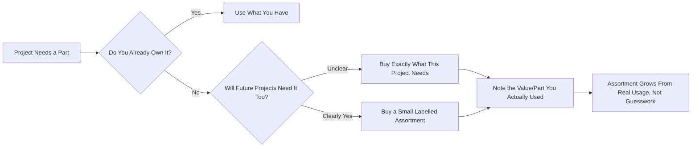
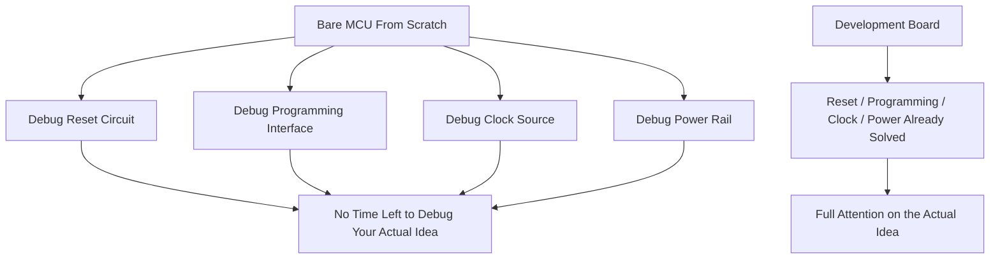

# 🧰 Components & Tools

One buy list, mapped to the folder structure you're actually working through. Do not buy a warehouse. Start with a development board and buy parts as a project calls for them; a small labelled assortment is useful only after you know which values you actually use. Move down this document level by level; don't skip to Level 10 tooling before Level 01 parts have taught you the basics.

## 📑 Table of Contents

1. [Buying Philosophy](#1-buying-philosophy)
2. [Level Map](#2-level-map)
3. [00 · Getting Started](#3-00--getting-started)
4. [01 · Basic Circuits](#4-01--basic-circuits)
5. [02 · Analog](#5-02--analog)
6. [03 · Digital](#6-03--digital)
7. [04 · Microcontrollers](#7-04--microcontrollers)
8. [05 · Embedded](#8-05--embedded)
9. [06 · PCB Design](#9-06--pcb-design)
10. [07 · Interfaces](#10-07--interfaces)
11. [08 · FPGA / RTL](#11-08--fpga--rtl)
12. [09 · Computer Architecture](#12-09--computer-architecture)
13. [10 · ASIC Design](#13-10--asic-design)
14. [11–13 · Semiconductor Devices, Fabrication & Advanced Hardware](#14-1113--semiconductor-devices-fabrication--advanced-hardware)
15. [Minimum Viable Kit, Per Level](#15-minimum-viable-kit-per-level)

## 1. Buying Philosophy

Buy against a project's Bill of Materials, not against a fear of running out. A part sitting unused in a bin doesn't teach you anything; it just ages.

> **On pricing:** Where ₹ figures appear (Levels 06–10), they are rough Indian street/import estimates for single-unit hobbyist quantities. Genuine branded gear carries import duty and GST on top; clones and open-hardware equivalents are cheaper but need vendor vetting for calibration-sensitive work.

[⬆ Back to top](#-table-of-contents)

## 2. Level Map

| Level | Folder | What You're Buying For |
|---|---|---|
| 00 | `00-getting-started` | Nothing yet. Just a dev board and the willingness to read its docs. |
| 01 | `01-basic-circuits` | Passives, LEDs, buttons, first transistors. |
| 02 | `02-analog` | MOSFETs, comparators, timers, gate drivers, power management. |
| 03 | `03-digital` | 74HC-family logic ICs. |
| 04 | `04-microcontrollers` | The dev board itself. |
| 05 | `05-embedded` | Sensors, relays/SSRs, real-world I/O. |
| 06 | `06-pcb-design` | SMD soldering, rework, assembly tools. |
| 07 | `07-interfaces` | Level shifters, ADC/DAC, EEPROM, displays, UART/CAN bridges. |
| 08 | `08-fpga-rtl` | PMOD modules, JTAG/SWD debuggers. |
| 09 | `09-computer-architecture` | Same debugger tooling as 08, applied to full cores. |
| 10 | `10-asic-design` | Shuttle-run prototyping boards, external flash. |
| 11–13 | `11-semiconductor-devices` → `13-advanced-hardware` | Mostly software (simulators, EDA, virtual labs) and reading, not a shopping list see the note in [section 14](#14-1113--semiconductor-devices-fabrication--advanced-hardware). |

[⬆ Back to top](#-table-of-contents)

## 3. 00 · Getting Started

No purchases at this stage beyond a development board (see [Level 04](#7-04--microcontrollers)). This folder is documentation and setup: install the toolchain, flash the blink example, confirm you can actually talk to the board before buying anything else.

[⬆ Back to top](#-table-of-contents)

## 4. 01 · Basic Circuits

The vocabulary of every circuit that follows.

| Stock |
|---|
| Resistors, assorted values |
| LEDs (a few colors) |
| Pushbuttons |
| Potentiometers |
| Ceramic and electrolytic capacitors |
| Diodes |
| A few NPN BJTs, such as BC547 |

[⬆ Back to top](#-table-of-contents)

## 5. 02 · Analog

Switching, signal conditioning, and power components live here.

| Stock | Notes |
|---|---|
| N-channel MOSFETs | Select for the gate voltage you'll actually drive them with, not just current rating. |
| Comparators — LM393 (dual), LM339 (quad) | Open-drain output, needs a pull-up resistor; cheap enough to socket a few permanently on a proto board. |
| Timers and oscillators — NE555 (single), NE556 (dual) | The 555 is still the fastest way to prototype a PWM/astable/monostable stage before moving it into firmware. |
| LDOs — LM7805 (fixed 5V), AMS1117-3.3 (fixed 3.3V), LM317 (adjustable) | Read input range, output current, thermal limits, and dropout voltage before connecting a load. |
| Buck converters — MP1584EN, LM2596 module | Check switching frequency and minimum load; some buck ICs misbehave at very low output current. |
| Boost converters — MT3608, XL6009 module | Read maximum duty cycle and inductor requirements; boost topologies are less forgiving of a wrong inductor than buck. |

### Advanced Power & High-Power Switching

| Item | Purpose | Approx. Price (₹) | Notes |
|---|---|---|---|
| Mechanical Relay Module (5V, opto-isolated) | Switching AC loads from MCU logic | ₹70 – ₹150 | Contact bounce and audible click; fine for low-cycle-count loads. |
| Fotek-style Solid State Relay (SSR, 25A) | Switching AC loads without contact bounce | ₹350 – ₹650 | Needs a heatsink at real load current; check zero-crossing spec for inductive loads. |
| Gate Driver IC — IR2110 (high/low-side) | Driving power MOSFETs at high PWM frequency | ₹40 – ₹90 | Needed once MCU pin drive current can't switch the gate fast enough. |
| Gate Driver IC — TC4427 (dual low-side) | Same, simpler single-rail driving | ₹60 – ₹110 | Easier to design around than IR2110 for non-half-bridge topologies. |
| Current Shunt Resistors (0.01Ω – 0.1Ω, precision) | High-precision current sensing | ₹10 – ₹30 each | Lower resistance = less power loss but smaller sense voltage; pair with an instrumentation amp or dedicated current-sense IC. |

[⬆ Back to top](#-table-of-contents)

## 6. 03 · Digital

Generic "grab some 74HC logic" is not a buy list. Here's what to actually stock, by function.

| Function | Part | Notes |
|---|---|---|
| Basic gates (NAND) | 74HC00 | Quad 2-input NAND; the gate every other gate can theoretically be built from. |
| Basic gates (NOT/inverter) | 74HC04 | Hex inverter; also useful as a crude oscillator with a resistor and cap. |
| Basic gates (AND) | 74HC08 | Quad 2-input AND. |
| Basic gates (OR) | 74HC32 | Quad 2-input OR. |
| Basic gates (XOR) | 74HC86 | Quad 2-input XOR; handy for parity and comparator logic. |
| Schmitt-trigger inverter | 74HC14 | Cleans up slow/noisy edges (debouncing a switch, squaring up a sensor signal) before it hits digital logic. |
| D-type flip-flop | 74HC74 | Dual D flip-flop with set/reset; the building block for registers and simple state machines. |
| JK flip-flop | 74HC112 | Dual JK flip-flop; useful for toggle/divide-by-2 circuits. |
| Binary counter | 74HC393 | Dual 4-bit binary counter; good for clock division without writing firmware. |
| Decade counter | 74HC390 | Dual decade counter, useful for BCD/7-segment driving. |
| 3-to-8 line decoder | 74HC138 | Common for address decoding and driving one-of-many select lines. |
| Data selector/multiplexer | 74HC157 | Quad 2-input mux; selects between two 4-bit data sources. |
| Octal buffer/line driver | 74HC244 | Non-inverting tri-state buffer; useful for bus driving and level isolation. |
| Bus transceiver | 74HC245 | Octal bidirectional bus transceiver with direction control. |

> **Note:** Shift registers (74HC595, 74HC165) are listed under [07 · Interfaces](#10-07--interfaces) since they're almost always bought for a specific interfacing job (driving LEDs, reading buttons) rather than pure logic-teaching purposes.

[⬆ Back to top](#-table-of-contents)

## 7. 04 · Microcontrollers

A board removes reset circuitry, programming connectors, clock choices, and power mistakes from the first experiment. That is a feature, not a shortcut.

| Board | Best For | Notes |
|---|---|---|
| [Arduino Uno R4 WiFi](https://docs.arduino.cc/hardware/uno-r4-wifi/) | A familiar entry point | Official documentation and a convenient, well-supported ecosystem. |
| [Arduino Nano ESP32](https://docs.arduino.cc/hardware/nano-esp32/) | Compact wireless projects | ESP32-S3 board with Wi-Fi, Bluetooth, USB-C; supports both Arduino and MicroPython documentation. |
| [Raspberry Pi Pico W](https://www.raspberrypi.com/documentation/microcontrollers/pico-series.html) | Budget-friendly, well-documented work | Useful for C/C++, MicroPython, GPIO, ADC, PWM, and wireless projects. |
| STM32 development boards | Vendor-level embedded work | Useful once you're ready for reference manuals, timers, DMA, ADCs, interrupts, and hardware debugging. Start with an official evaluation board before designing a bare STM32 board. |

Move to a bare MCU design only after the board-based version of the same project already works.

[⬆ Back to top](#-table-of-contents)

## 8. 05 · Embedded

| Stock | Notes |
|---|---|
| IMU — MPU6050 (accel + gyro) or MPU9250 (+ magnetometer) | I2C interface; MPU6050 is the cheapest way to learn sensor fusion and complementary/Kalman filtering. |
| Temperature sensor — DS18B20 (1-Wire, waterproof probe variants exist) or LM35 (analog) | DS18B20 teaches you a real 1-Wire protocol stack; LM35 is simplest for a first ADC-reading exercise. |
| Light sensor — LDR + resistor divider, or BH1750 (digital, I2C, lux output) | LDR is analog and quick to prototype; BH1750 gives calibrated lux over I2C if you want real numbers, not just relative brightness. |
| One digital sensor with a documented protocol — e.g. BME280 (I2C/SPI, temp/humidity/pressure) | Enough sensing variety for early projects without overbuying niche parts; BME280 is a good "reads a real datasheet" first exercise. |

[⬆ Back to top](#-table-of-contents)

## 9. 06 · PCB Design

| Item | Purpose | Approx. Price (₹) | Notes |
|---|---|---|---|
| SMD Practice Kit (0805, 0603, SOIC/QFP) | Master surface-mount soldering before real boards | ₹300 – ₹700 | Cheap, deliberately disposable practice boards do these before your first real PCB order. |
| Solder Paste (63/37 Sn/Pb or lead-free, syringe) | Reflow assembly, hand-paste SMD pads | ₹350 – ₹700 | Keep refrigerated; check the date before buying old stock. |
| Flux Gel (e.g. NC-559) | Improves wetting, reduces solder bridging | ₹200 – ₹450 | A small tub lasts a long time; don't over-buy. |
| Hot Air Rework Station (858D-style) | Placing QFN/QFP ICs, reflow, removing bridges | ₹1,800 – ₹3,200 | Entry-level but genuinely usable; get a stand and nozzle set with it. |
| Digital Calipers | Measuring component/board/connector dimensions for KiCad footprints | ₹350 – ₹900 | Stainless steel, not plastic ±0.02mm accuracy expected at this price. |
| SMD Tweezers (ESD-15, curved, non-magnetic) | Picking/placing 0805/0603 passives onto paste | ₹150 – ₹400 | Curved tip is easier for 0603 and below; keep a straight pair too. |

[⬆ Back to top](#-table-of-contents)

## 10. 07 · Interfaces

Bridges between your MCU's logic levels and everything else in the world.

| Stock | Notes |
|---|---|
| Logic-level shifters | |
| Shift registers | |
| ADCs and DACs | |
| EEPROM | |
| OLED displays | |
| USB-UART bridges | |
| CAN transceivers (e.g. MCP2515 + TJA1050) | Examples of CAN hardware, not mandatory beginner purchases. **Check the voltage domains and exact transceiver part number** CAN transceivers are not interchangeable across voltage domains. |

[⬆ Back to top](#-table-of-contents)

## 11. 08 · FPGA / RTL

### PMOD Expansion Modules

| Module | Purpose | Approx. Price (₹) | Notes |
|---|---|---|---|
| PMOD VGA / HDMI output | Testing custom video generators in Verilog/VHDL | ₹1,500 – ₹3,000 | Check your FPGA board's PMOD voltage (3.3V logic) before wiring. |
| PMOD SDRAM / PSRAM | Building memory controllers on FPGA | ₹2,500 – ₹4,500 | A real memory-controller RTL exercise, not a toy pinout to skip past. |
| PMOD 7-segment / rotary encoder | Hardware status displays and input | ₹700 – ₹1,300 | Cheapest way to get a physical UI onto an FPGA dev board. |

### Hardware Debuggers & Programmers

| Tool | Purpose | Approx. Price (₹) | Notes |
|---|---|---|---|
| ST-Link V2 (clone) | SWD debugging on STM32/ARM cores | ₹200 – ₹400 | Fine for hobbyist use. |
| J-Link EDU / OB variant | SWD/JTAG debugging, step-through on ARM/RISC-V | ₹4,500 – ₹6,000 (genuine EDU) | Segger's official educational license is worth it once you outgrow OpenOCD quirks. |
| CMSIS-DAP compatible probe | Open-standard SWD/JTAG debugging | ₹350 – ₹700 | Good open-source-friendly middle ground. |
| FT2232H Breakout Board | Custom JTAG programming, SPI flash burning, boundary scan | ₹900 – ₹1,600 | Dual-channel USB-to-MPSSE; the workhorse chip behind many open-source programmers. |

### General Diagnostics (useful from here onward)

| Tool | Purpose | Approx. Price (₹) | Notes |
|---|---|---|---|
| USB Logic Analyzer (8-ch, 24 MHz) | Decode I2C, SPI, UART, CAN in software | ₹250 – ₹600 | Clone boards are cheap and adequate for protocol-level debugging. |
| Entry-level Oscilloscope (Rigol DS1054Z) | Signal integrity, noise, PWM edge rates | ₹32,000 – ₹42,000 | The de facto hobbyist/pro crossover scope. |
| Budget Oscilloscope (FNIRSI-1013D) | Same, lower budget | ₹6,000 – ₹9,000 | Good enough for embedded/PWM work, not for serious RF. |
| USB Oscilloscope (Analog Discovery 2) | Scope + logic analyzer + waveform generator in one | ₹28,000 – ₹35,000 | Check for student/academic discounts via Digilent resellers. |
| RF Accessories (SMA cables, 50Ω terminators, attenuators) | Testing Wi-Fi/BLE antenna paths, high-speed clock lines | ₹150 – ₹1,500 per item | Buy only the connector type your board actually uses (SMA vs. U.FL). |

[⬆ Back to top](#-table-of-contents)

## 12. 09 · Computer Architecture

No new component category here reuse the debuggers and diagnostics from [Level 08](#11-08--fpga--rtl). What changes is the target: instead of a single RTL module, you're debugging a full core (pipeline, cache, memory hierarchy), so lean more on the software side Gem5, Renode, QEMU, Ripes from your simulation toolkit than on new hardware purchases.

[⬆ Back to top](#-table-of-contents)

## 13. 10 · ASIC Design

| Item | Purpose | Approx. Price (₹) | Notes |
|---|---|---|---|
| Tiny Tapeout / Caravel demo board | Interfacing with your own shuttle-run silicon via SPI/GPIO | ₹3,000 – ₹6,000 | Import item; check current Tiny Tapeout shuttle documentation for the exact board revision you need. |
| W25Q128 SPI NOR Flash | Storing bootloaders/bitstreams for FPGAs and open RISC-V cores | ₹60 – ₹120 | 128 Mbit; verify your FPGA toolchain's flash size expectations before ordering. |
| W25Q64 SPI NOR Flash | Smaller bootloader/bitstream storage | ₹35 – ₹70 | 64 Mbit; cheaper option when your bitstream comfortably fits. |

[⬆ Back to top](#-table-of-contents)

## 14. 11–13 · Semiconductor Devices, Fabrication & Advanced Hardware

These three folders are the point where the "buy a part" model runs out. You are not purchasing silicon at the device-physics or fab-process level as a hobbyist. What actually fills these folders:

| Folder | What Fills It | Where |
|---|---|---|
| `11-semiconductor-devices` | Device physics simulation, transistor-level modeling | NanoHub, LTspice/Ngspice device models |
| `12-semiconductor-fabrication` | RTL-to-GDSII flow, layout, LVS tooling | OpenLane, Magic VLSI, KLayout, Netgen |
| `13-advanced-hardware` | Reading, coursework, and community depth rather than hardware | University lecture series (Razavi, Mutlu, Hajimiri), papers, forums |

No purchase list applies here revisit your simulation and learning-resources references instead of this document.

[⬆ Back to top](#-table-of-contents)

## 15. Minimum Viable Kit, Per Level

- [ ] **00–01:** Passives, LEDs, buttons, a handful of BC547-class BJTs
- [ ] **02–03:** A few MOSFETs (rated for your gate-drive voltage), comparators/timers, a couple of 74HC logic ICs
- [ ] **04:** One development board matched to the project, not the most powerful one available
- [ ] **05:** One sensor per project, not one of everything "just in case"
- [ ] **06:** SMD practice kit + solder paste + flux gel before your first real PCB order; calipers before designing any footprint
- [ ] **07:** Only the interface parts (level shifter, ADC/DAC, EEPROM, display, UART/CAN bridge) the current project actually calls for
- [ ] **08–09:** One logic analyzer, one debugger matched to your MCU/FPGA toolchain, PMOD modules only as a project needs them
- [ ] **10:** Tiny Tapeout/Caravel hardware only after you have an actual shuttle-run design to interface with
- [ ] **11–13:** No purchase software tooling and reading time instead

[⬆ Back to top](#-table-of-contents)
