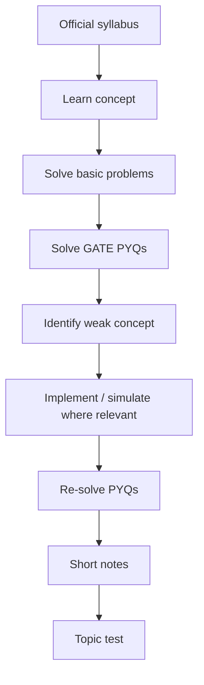
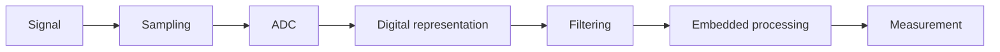
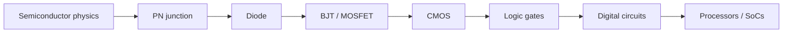
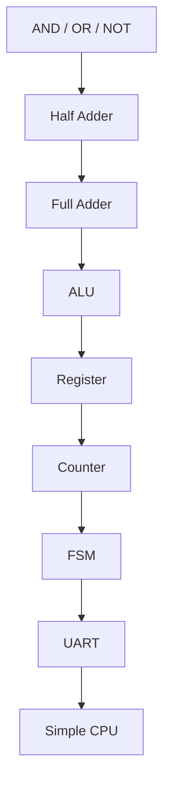
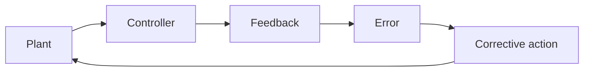
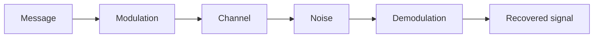
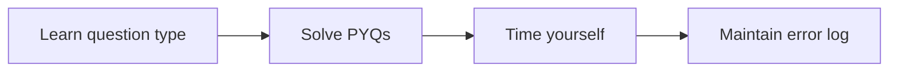
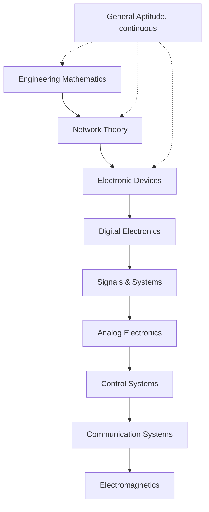
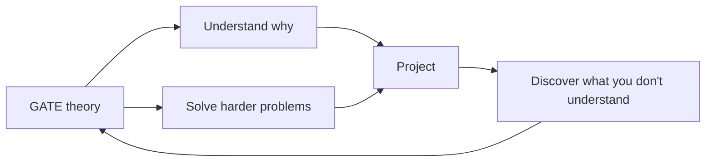
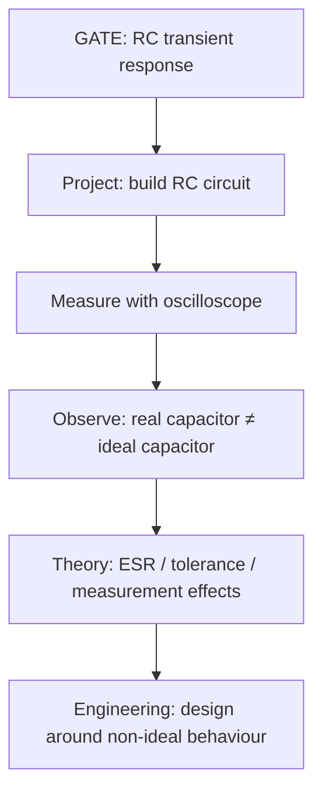

# 🎯📐 GATE Prep

GATE prep is a **parallel theory track**, not the goal of this roadmap. The roadmap is about learning to **build hardware and understand systems by implementing them**; GATE strengthens the math and electronics theory underneath those projects.

Not: "Finish GATE lectures, then build projects."
Instead: **Learn theory, solve GATE problems, implement the idea, return to theory with better intuition.**

A project doesn't prove GATE readiness, and GATE questions don't prove you can build hardware.

## 📑🔧 Quick Index

1. [Current GATE Reference](#1-current-gate-reference)
2. [GATE & Hardware Philosophy](#2-gate--hardware-philosophy)
3. [Recommended Study Loop](#3-recommended-study-loop)
4. [Resource Rule](#4-resource-rule)
5. [Subject-by-Subject Resource Map](#5-subject-by-subject-resource-map)
   - [Engineering Mathematics](#51-engineering-mathematics)
   - [Network Theory](#52-network-theory)
   - [Signals and Systems](#53-signals-and-systems)
   - [Electronic Devices](#54-electronic-devices)
   - [Digital Electronics](#55-digital-electronics)
   - [Analog Electronics](#56-analog-electronics)
   - [Control Systems](#57-control-systems)
   - [Communication Systems](#58-communication-systems)
   - [Electromagnetics](#59-electromagnetics)
   - [General Aptitude](#510-general-aptitude)
6. [PYQs Are Not Optional](#6-pyqs-are-not-optional)
7. [A Practical Completion Standard](#7-a-practical-completion-standard)
8. [GATE & Project Mapping](#8-gate--project-mapping)
9. [Recommended Order](#9-recommended-order)
10. [Weekly Integration](#10-weekly-integration-with-the-hardware-roadmap)
11. [The 70% Rule](#11-the-70-rule)
12. [What Not to Do](#12-what-not-to-do)
13. [The Minimal Free Stack](#13-the-minimal-free-stack)
14. [Recommended Books](#14-recommended-books)
15. [How GATE Should Interact With the Roadmap](#15-how-gate-should-interact-with-the-roadmap)
16. [Final Rule](#16-final-rule)

## 1. Current GATE Reference

Use the official **GATE 2027** site, not old GATE 2026 links.

| Resource | Link |
|---|---|
| Official portal | https://gate2027.iitm.ac.in/ |
| EC syllabus | https://gate2027.iitm.ac.in/static/doc/GATE2027_Syllabus/EC_GATE2027_Syllabus.pdf |
| Paper pattern | https://gate2027.iitm.ac.in/question_paper_pattern |
| Exam papers & syllabus | https://gate2027.iitm.ac.in/exam_papers_and_syllabus |
| Notifications | https://gate2027.iitm.ac.in/notifications |

GATE 2027 is organized by IIT Madras, scheduled **Feb 6–21, 2027**, results on **March 19, 2027**. Always verify dates on the official portal.

**EC paper breakdown**

| Section | Marks |
|---|---|
| General Aptitude | 15 |
| Engineering Mathematics | 13 |
| EC technical subjects | 72 |
| **Total** | **100** |

65 questions, 3 hours, mix of MCQ/MSQ/NAT. Negative marking applies to incorrect MCQs only.

**Do not build this README around an old syllabus.** Recheck this section whenever a new cycle is announced.

## 2. GATE & Hardware Philosophy

| Tier | Subjects | Why |
|---|---|---|
| **A: Directly reinforces roadmap** | Engineering Math, Network Theory, Signals & Systems, Electronic Devices, Digital Electronics, Analog Electronics, embedded fundamentals | Improves real engineering ability |
| **B: Supporting theory** | Control Systems, Communication Systems, Electromagnetics | Useful depending on whether you go toward embedded, FPGA, RF, robotics, VLSI, or comms |
| **C: Exam-oriented** | General Aptitude, speed techniques, question patterns, formula memorization | Needed for the exam, shouldn't eat project time |

## 3. Recommended Study Loop

Avoid a lecture-only loop where finishing videos feels like finishing the syllabus. Use this loop instead:

A topic is reasonably complete when you can:
1. Explain the concept without the lecture.
2. Solve representative PYQs.
3. Identify why a wrong option is wrong.
4. Solve a modified version of the problem.
5. Apply it in a circuit, simulation, HDL design, or embedded system where relevant.

## 4. Resource Rule

Use **one primary lecture source + one reference + PYQs**, not five teachers and seven Telegram PDFs for the same chapter. That's resource hoarding, not preparation.

A r/GATEtard thread from a student with a 6xx EC rank shared a subject-wise, free-resource-only approach rather than trying to use everything available. Another thread recommended a simple loop: lecture, deeper reference, PYQs, patch weaknesses, using PYQ accuracy as a progression signal.

## 5. Subject-by-Subject Resource Map

### 5.1 Engineering Mathematics

**Covers:** linear algebra, calculus, differential equations, vector analysis, complex analysis, probability and statistics.

| Role | Source |
|---|---|
| Primary | Vishal Soni, [PrepFusion](https://www.youtube.com/@PrepFusion_GATE) |
| Deeper reference | [NPTEL](https://nptel.ac.in/), only when the GATE explanation leaves a gap |
| Practice | Concept → 15-30 basic problems → PYQs → error log |

### 5.2 Network Theory

One of the **highest-value subjects** for this roadmap.

**Covers:** KCL/KVL, node/mesh analysis, superposition, Thevenin, Norton, reciprocity, max power transfer, phasors, AC steady state, complex power, RL/RC/RLC, Laplace-domain analysis, two-port networks, Y-Δ transforms.

| Role | Source |
|---|---|
| Primary | Umesh Dhandhe / GATE Academy |
| Alternative | Ankit Goyal |
| Conceptual alternative | [Neso Academy](https://www.youtube.com/@nesoacademy) |
| Book | Alexander & Sadiku, *Fundamentals of Electric Circuits* (a 2026 ECE thread specifically named this book) |

Connect it directly to RC/RL experiments, SPICE simulation, PCB debugging, ADC front ends, sensor circuits, filters, and power circuits. If you study Thevenin's theorem, use it on a real circuit; if you study RC transients, measure one.

### 5.3 Signals and Systems

**Covers:** CT signals, Fourier series/transform, sampling, DT signals, DTFT, DFT, Z-transform, LTI systems, convolution, causality, stability, impulse response, poles/zeros, frequency response, group/phase delay.

| Role | Source |
|---|---|
| Primary | [PrepFusion](https://www.youtube.com/@PrepFusion_GATE) |
| Conceptual | [NPTEL courses](https://nptel.ac.in/courses) |
| Deeper conceptual | MIT OpenCourseWare / Oppenheim, recommended by r/GATEtard for building intuition rather than pure exam prep |

Mini-project: generate a noisy sensor signal, sample it, inspect aliasing, filter it, compare the reconstructed signal against the original.

### 5.4 Electronic Devices

Critical if the roadmap moves toward semiconductors, VLSI, FPGA-adjacent hardware, or transistor-level understanding.

**Covers:** energy bands, intrinsic/extrinsic semiconductors, carrier concentration, drift, diffusion, mobility, resistivity, generation/recombination, Poisson and continuity equations, PN junction, Zener diode, BJT, MOS capacitor, MOSFET, LED, photodiode, solar cell.

| Role | Source |
|---|---|
| Primary | [NPTEL semiconductor-device courses](https://nptel.ac.in/), often preferable to a rushed crash course |
| Books (reference only, not cover-to-cover) | Donald Neamen, *Semiconductor Physics and Devices*; Streetman & Banerjee, *Solid State Electronic Devices* |

A 2026 thread specifically recommended an IISc/NPTEL semiconductor-device course for EDC/device fundamentals.

### 5.5 Digital Electronics

Arguably the **single best overlap subject** for this roadmap.

**Covers:** Boolean algebra, logic gates, K-maps, combinational circuits, adders/subtractors, MUX/DEMUX, decoders, encoders, comparators, sequential circuits, latches, flip-flops, counters, registers, memories, FSMs, timing, ADC/DAC-adjacent digital concepts.

| Role | Source |
|---|---|
| Primary | [Gate Smashers](https://www.youtube.com/@GateSmashers), beginner-friendly, strong logic-gate and full-adder material |
| Alternative | [NPTEL, Digital Electronic Circuits](https://nptel.ac.in/) |
| Book | M. Morris Mano, *Digital Design* |

Don't stop at "I understand flip-flops." Build up:

For FPGA work, implement the same concepts in Verilog/SystemVerilog. That's the point where this becomes engineering rather than trivia.

### 5.6 Analog Electronics

**Covers:** diode circuits, clippers, clampers, rectifiers, BJT/MOSFET amplifiers, biasing, small-signal models, frequency response, feedback, op-amps, oscillators, active filters.

| Role | Source |
|---|---|
| Primary | PrepFusion / Ankit Goyal |
| Deeper understanding | Sedra/Smith, *Microelectronic Circuits*; Behzad Razavi, *Fundamentals of Microelectronics* (especially valuable if heading toward VLSI) |

A recent r/GATE_EE_ECE_IN thread recommended Razavi for Network Theory and Analog Circuits, and Neamen/Streetman for devices.

Turn every major concept into a SPICE simulation, breadboard circuit, oscilloscope measurement, ADC experiment, sensor interface, transistor amplifier, or filter.

### 5.7 Control Systems

Matters if the roadmap enters robotics, motors, drones, autonomous systems, embedded control, or instrumentation.

**Covers:** transfer functions, block diagrams, time response, stability, Routh-Hurwitz, root locus, Bode plots, Nyquist, state-space basics.

| Role | Source |
|---|---|
| Primary | [PrepFusion](https://www.youtube.com/@PrepFusion_GATE) |
| Alternative | [Neso Academy](https://www.youtube.com/@nesoacademy), good conceptual explanations |

Simulate this in Python/MATLAB/Octave first, then implement a simple controller on an MCU.

### 5.8 Communication Systems

Study seriously if heading toward wireless systems, SDR, RF, IoT, comms protocols, or signal processing.

**Covers:** analog and digital modulation, sampling, noise, probability of error, information theory basics, communication channels.

| Role | Source |
|---|---|
| Primary | [PrepFusion](https://www.youtube.com/@PrepFusion_GATE) |
| Deeper | [NPTEL communication-system courses](https://nptel.ac.in/) |

An SDR project is an excellent bridge between GATE Communications and real engineering.

### 5.9 Electromagnetics

Don't make this the first subject you study. Useful for RF, antennas, transmission lines, high-speed digital systems, PCB signal integrity, microwave engineering.

| Role | Source |
|---|---|
| Primary | A GATE-oriented course, e.g. PrepFusion / Sidharth Shabharwal |
| Deeper | [NPTEL Electromagnetic Theory](https://nptel.ac.in/) |
| Book | Sadiku, *Elements of Electromagnetics* |

Build vector-calculus fundamentals before diving into EMFT; don't jump into Maxwell's equations while shaky on vector calculus.

### 5.10 General Aptitude

Don't spend months "studying aptitude."

Prioritize percentages, ratios, averages, probability, permutations/combinations, data interpretation, logical reasoning, reading comprehension, and basic numerical reasoning. Worth 15 marks, so treat it as a scoring component, not a last-week afterthought.

## 6. PYQs Are Not Optional

PYQs are the primary measurement of preparation.

| Pass | When | How |
|---|---|---|
| First | Right after learning a topic | Solve without the solution; mark ✓ correct/confident, ? correct but guessed, ✗ incorrect |
| Second | After finishing the subject | Solve again without looking at your previous answers |
| Third | During revision | Solve under time pressure |

**PYQ resources**

| Resource | Notes |
|---|---|
| [PrepFusion PYQ Hub](https://pyq.prepfusion.in/) | Specifically recommended in a 2026 ECE resource thread |
| [GATE Overflow](https://gateoverflow.in/) | Use when a solution is unclear or interpretations differ |
| [Official GATE 2027 papers](https://gate2027.iitm.ac.in/exam_papers_and_syllabus) | Final authority |

## 7. A Practical Completion Standard

Use this checklist for **every subject**:

- [ ] Read official syllabus
- [ ] Divide syllabus into chapters
- [ ] Select one primary lecture source
- [ ] Complete concept lectures
- [ ] Make short notes
- [ ] Solve basic problems
- [ ] Solve topic-wise PYQs
- [ ] Review every incorrect PYQ
- [ ] Maintain error log
- [ ] Reattempt incorrect questions
- [ ] Take a subject test
- [ ] Revisit weak chapters
- [ ] Solve mixed PYQs

A checkmark on every video doesn't mean the subject is done.

## 8. GATE & Project Mapping

| GATE topic | Build alongside it |
|---|---|
| Linear algebra | CPU/ML/graphics mathematics |
| Calculus | Signal/control modelling |
| Probability | Communications/noise |
| Network Theory | SPICE circuits |
| Signals | ADC/DSP pipeline |
| Electronic Devices | Transistor/MOSFET experiments |
| Digital Electronics | Verilog modules |
| Sequential Logic | FSM/UART/controller |
| Analog | Amplifier/filter |
| Control | Motor/robot controller |
| Communications | SDR/modulation experiment |
| EMFT | Transmission-line/RF experiment |

Don't force every chapter into a project; some material is examinable, not project-worthy.

## 9. Recommended Order

This isn't the only valid order. One r/GATEtard thread used Maths → Network → EDC → Digital → Signals → Control → Analog → Communication → EMFT; another preferred starting with Network/EDC/Signals and leaving Maths/EMT for later. For **this** roadmap, the order above is preferable since it builds useful circuit and digital foundations early.

## 10. Weekly Integration With the Hardware Roadmap

Don't turn the roadmap into a coaching timetable.

| Day | Hardware | GATE |
|---|---|---|
| Mon | 5-6 h | 1-2 h |
| Tue | 5-6 h | 1-2 h |
| Wed | 5-6 h | 1-2 h |
| Thu | 5-6 h | 1-2 h |
| Fri | 5-6 h | 1-2 h |
| Sat | Project implementation | PYQs / revision |
| Sun | Debugging / documentation | Weekly test + error review |

Adjust hours around university workload. The principle matters more than the numbers: **GATE should accumulate weekly rather than explode into a six-week panic session.**

## 11. The 70% Rule

Don't wait for perfect mastery before moving on.

| PYQ accuracy | Action |
|---|---|
| Under 50% | Revisit concepts |
| 50-70% | More targeted problems |
| 70-85% | Continue, maintain |
| 85%+ | Move forward, periodically revise |

These percentages aren't official GATE requirements, just a practical progress metric. A community workflow similarly suggested roughly 70%+ PYQ accuracy as a signal to move on.

## 12. What Not to Do

| Don't | Why |
|---|---|
| Watch five teachers for one subject | Pick one and go deep |
| Make 80-page notes | Make notes you'll actually revise |
| Solve only easy questions | GATE rewards application and analysis, not recognition |
| Postpone PYQs | Start them while learning the subject |
| Treat PYQs as another lecture | Try the problem yourself first |
| Blindly follow weightage charts | The syllabus is the authority |
| Let GATE consume the roadmap | The goal is to understand hardware, not maximize a score |
| Use projects as GATE substitutes | Building a UART doesn't mean mastering all of Digital Electronics |
| Use GATE as an excuse to avoid building | You should be able to explain a circuit *and* build/debug one |

## 13. The Minimal Free Stack

If money is tight, this is enough:

| Purpose | Resource |
|---|---|
| Theory | [PrepFusion](https://www.youtube.com/@PrepFusion_GATE/) |
| Digital | [Gate Smashers](https://www.youtube.com/@GateSmashers/) |
| Deep university-level theory | [NPTEL](https://nptel.ac.in/) |
| PYQs | [PrepFusion PYQ Hub](https://pyq.prepfusion.in/) |
| Discussion / hard solutions | [GATE Overflow](https://gateoverflow.in/) |
| Official authority | [GATE 2027 portal](https://gate2027.iitm.ac.in/) |

You don't need 14 paid courses to start.

## 14. Recommended Books

| Subject | Reference |
|---|---|
| Digital | Morris Mano, *Digital Design* |
| Network | Alexander & Sadiku, *Fundamentals of Electric Circuits* |
| Devices | Neamen, *Semiconductor Physics and Devices* |
| Devices | Streetman & Banerjee, *Solid State Electronic Devices* |
| Analog | Razavi, *Fundamentals of Microelectronics* |
| Analog | Sedra/Smith, *Microelectronic Circuits* |
| Signals | Oppenheim, *Signals and Systems* |
| EMFT | Sadiku, *Elements of Electromagnetics* |
| Mathematics | Any standard engineering mathematics reference |

**Rule:** a book is a reference, not a checklist. Spending three months reading 700 pages with little applied afterward is textbook completion, not engineering.

## 15. How GATE Should Interact With the Roadmap

Worked example:

This feedback loop is far more valuable than treating GATE as an isolated exam.

## 16. Final Rule

**Build first. Study alongside it. Use GATE to expose gaps in your fundamentals. Use projects to expose gaps in your understanding.**

Not the goal: "I finished the GATE syllabus."
The goal: **"I understand the theory well enough to reason about a circuit/system, solve unfamiliar problems, and implement the underlying idea."**

GATE is the measurement and reinforcement layer. The hardware roadmap remains the main thing being built.
