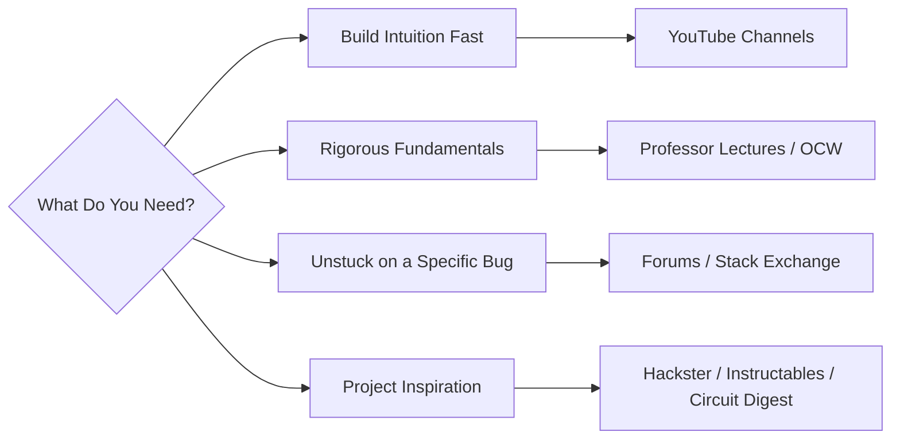

# 🎓 Applied Learning Resources

A curated set of YouTube channels, university lectures, and communities for going deeper than a datasheet. Use this alongside the simulation and sourcing guides once you know *what* you're building; use this list to learn *why* it works.

## 📑 Table of Contents

1. [Choosing a Resource](#1-choosing-a-resource)
2. [Applied YouTube Channels](#2-applied-youtube-channels)
3. [World-Class Professors & University Lectures](#3-world-class-professors--university-lectures)
4. [Communities & Forums](#4-communities--forums)
5. [Minimum Viable Learning Loop](#5-minimum-viable-learning-loop)

## 1. Choosing a Resource

Not every question belongs on every platform. Match the resource to the kind of gap you're trying to close.

* **Build intuition fast:** a channel with good visuals and a working bench will get you there quicker than a textbook chapter.
* **Rigorous fundamentals:** university lecture series exist because a 15-minute video can't derive a transistor model properly skip to these when you need the math, not just the vibe.
* **Unstuck on a specific bug:** forums beat videos here; someone has almost certainly hit your exact error before.
* **Project inspiration:** community write-ups show you finished, working builds you can reverse-engineer.

[⬆ Back to top](#-table-of-contents)

## 2. Applied YouTube Channels

| Channel | Focus | Best For |
|---|---|---|
| [Nevon Projects](https://www.youtube.com/@NevonProjectsOfficial) | DIY electronics, embedded systems, mechanical builds | Browsing a massive library of complete project builds. |
| [CaptiveAire](https://www.youtube.com/@CAPTIVEAIRE) | Turbomachinery, HVAC systems, fan wheel design | High-production deep-dives that build physical systems intuition, not just electronics. |
| [Phil's Lab](https://www.youtube.com/@PhilsLab) | KiCad PCB layout, STM32, mixed-signal design | Advanced hardware design done at a professional level. |
| [Ben Eater](https://www.youtube.com/@BenEater) | Breadboard 8-bit computers, logic gates, 6502 assembly | Legendary step-by-step builds that connect logic gates to a working CPU by hand. |
| [Robert Feranec](https://www.youtube.com/@RobertFeranec) | High-speed PCB design, signal integrity, Altium/KiCad | Professional layout reviews and real design-review workflow. |
| [w2aew](https://www.youtube.com/@w2aew) | RF fundamentals, oscilloscopes, analog measurement | Exceptional conceptual breakdowns of how your test equipment actually works. |
| [The Signal Path](https://www.youtube.com/@TheSignalPath) | RF, microwave test equipment, chip teardowns | High-end component-level teardowns of professional gear. |
| [GreatScott!](https://www.youtube.com/@GreatScottLab) & [ElectroBOOM](https://www.youtube.com/@ElectroBOOM) | Hobbyist electronics, power management, electrical safety | Practical demonstrations including what happens when things go wrong. |
| [Andreas Spiess](https://www.youtube.com/@AndreasSpiess) | ESP32s, wireless sensors, IoT nodes, battery life | Rigorous, repeatable real-world testing of IoT hardware claims. |

[⬆ Back to top](#-table-of-contents)

## 3. World-Class Professors & University Lectures

| Professor / Institution | Subject | Where to Find |
|---|---|---|
| Prof. Behzad Razavi (UCLA) | Microelectronics, RF IC Design | Search his name alongside "Microelectronics" or "RF IC Design" on university portals or YouTube the gold standard in analog engineering lectures. |
| [Prof. Onur Mutlu (ETH Zürich / CMU)](https://www.youtube.com/@OnurMutluLectures) | Computer Architecture, Memory Systems, Hardware Design | Onur Mutlu Lectures on YouTube full comprehensive course series. |
| Prof. Ali Hajimiri (Caltech) | High-frequency electronics, electromagnetics | Look up his Caltech electives on these topics. |
| [Prof. Anant Agarwal (MIT OCW)](https://ocw.mit.edu/courses/6-002-circuits-and-electronics-spring-2007/) | Circuits and Electronics | MIT 6.002 on MIT OpenCourseWare. |
| Prof. Bradley Minch (Olin College) | CMOS design, LTspice | Search his name for hands-on CMOS design and LTspice tutorials. |
| [Prof. James Fiore (MVCC)](https://www.youtube.com/@jamesfiore) | AC/DC circuits, semiconductors, op-amps | "Electronics with Professor Fiore" complete college-level video courses. |

[⬆ Back to top](#-table-of-contents)

## 4. Communities & Forums

| Community | Focus | Best For |
|---|---|---|
| [Hack Club](https://hackclub.com/) | Student-led making and hardware communities | Finding collaborators and peer projects. |
| [Hackster.io](https://www.hackster.io/) | Project write-ups, board guides, MCU integration examples | Reverse-engineering a finished project's full BOM and code. |
| [Instructables Circuits](https://www.instructables.com/circuits/) | Step-by-step beginner builds | Visual, low-friction project inspiration. |
| [Circuit Digest](https://circuitdigest.com/) | Indian-centric electronics articles and project guides | Regionally relevant sourcing and project context. |
| [Electrical Engineering Stack Exchange](https://electronics.stackexchange.com/) | Formal, rigorous Q&A | Reproducible engineering answers and circuit math, not opinions. |
| [Arduino Forum](https://forum.arduino.cc/) | Arduino ecosystem support | Board- and library-specific debugging. |
| [Espressif Forum](https://www.esp32.com/) | ESP32 ecosystem support | Firmware and Wi-Fi/BLE stack debugging. |
| [Raspberry Pi Forums](https://forums.raspberrypi.com/) | Raspberry Pi ecosystem support | OS, GPIO, and Pico-specific debugging. |

> **Golden rule:** A forum answer that isn't reproducible isn't an answer. Prefer threads where someone posted the fix *and* explained why it worked.

[⬆ Back to top](#-table-of-contents)

## 5. Minimum Viable Learning Loop

- [ ] Named the specific gap you're closing (intuition, fundamentals, a bug, or inspiration)
- [ ] Picked one channel or lecture series matched to that gap, not five at once
- [ ] Watched/read with the simulator or datasheet open alongside, not passively
- [ ] Reproduced at least one example from the resource yourself
- [ ] Took the specific unresolved question to the matching forum/community
- [ ] Recorded the answer somewhere you'll actually find it again

[⬆ Back to top](#-table-of-contents)
