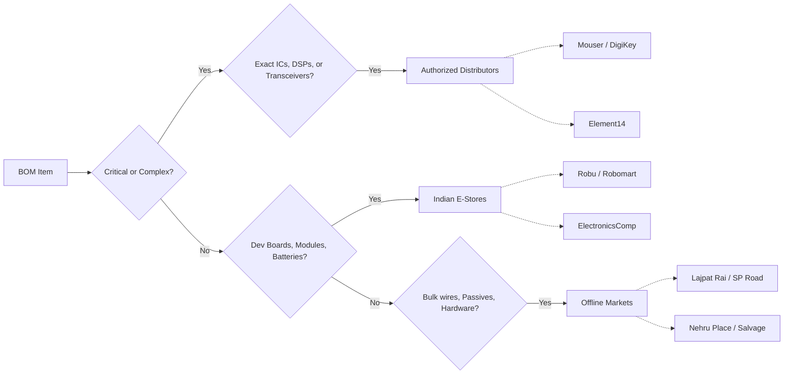
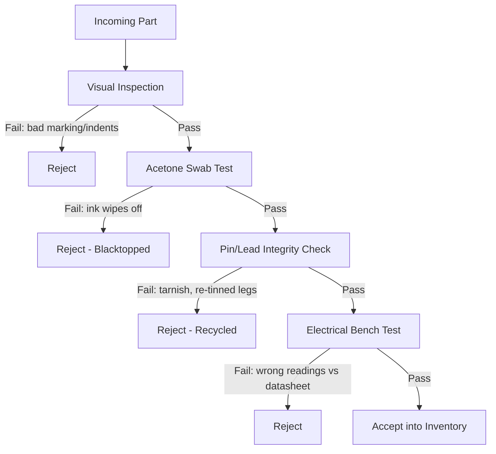

# 🇮🇳 Hardware Sourcing & Electronics Lab Guide

A comprehensive guide for sourcing components, building a diagnostic workbench, and verifying hardware integrity in India. Whether you are building simple microelectronics or complex embedded hybrid systems, this reference covers where to buy, what to stock, and how to avoid counterfeits.

## 📑 Table of Contents

1. [Component Categories & Sourcing Strategy](#1-component-categories--sourcing-strategy)
2. [Sourcing: Where to Buy](#2-sourcing-where-to-buy)
   - [Online E-Shopping](#online-e-shopping)
   - [Offline Markets & Salvage (NCR Focus)](#offline-markets--salvage-ncr-focus)
3. [The Essentials: What to Stock](#3-the-essentials-what-to-stock)
   - [Microcontrollers & Dev Boards](#microcontrollers--dev-boards)
   - [Component Inventory](#component-inventory)
   - [Power & Wiring](#power--wiring)
4. [Tools & Diagnostic Workbench](#4-tools--diagnostic-workbench)
   - [Measurement & Diagnostic Equipment](#41-measurement--diagnostic-equipment)
   - [Soldering & Rework Station](#42-soldering--rework-station)
   - [Hand Tools & Bench Accessories](#43-hand-tools--bench-accessories)
   - [Wiring](#44-wiring)
   - [Work Surfaces](#45-work-surfaces)
   - [Minimum Viable Bench Checklist](#46-minimum-viable-bench-checklist)
5. [Quality Control: Inspecting Parts](#5-quality-control-inspecting-parts)
   - [Inspection Workflow](#51-inspection-workflow)
   - [Physical & Chemical Tests](#52-physical--chemical-tests)
   - [Electrical Verification](#53-electrical-verification)
   - [Common Counterfeit/Recycled Red Flags](#54-common-counterfeitrecycled-red-flags)
6. [Communities & Simulation Tools](#6-communities--simulation-tools)

## 1. Component Categories & Sourcing Strategy

Before purchasing, categorize your Bill of Materials (BOM) to determine the right supplier. Never blindly trust a single marketplace for every component type.

[⬆ Back to top](#-table-of-contents)

## 2. Sourcing: Where to Buy

### Online E-Shopping

* **Element14, Mouser, DigiKey:** The gold standard for authentic ICs, specific microcontrollers, and precision components. Use these for complex development and safety-critical parts.
* **ElectronicsComp & Electronify India:** Reliable sources for common components, modules, and prototyping quantities.
* **Robomart & Robu.in:** Excellent for dev boards, maker hardware, and robotics. *Caution:* Do not place 100% trust in these for highly sensitive silicon, as cheap green PCBs or modules sometimes utilize rejected or recycled IC batches.

### Offline Markets & Salvage (NCR Focus)

* **Lajpat Rai Market / Chandni Chowk:** Ideal for extremely cheap, one-time-use bulk components, connectors, and hand tools. *Note: Vendors rarely accept returns for false or broken parts.*
* **Nehru Place:** Great for stripping old systems for usable parts, motors, and heatsinks, or finding almost-unused second-hand electronics to reverse engineer.
* **Maker Junction & Robosaki:** Good local hubs for maker supplies and rapid prototyping.
* **PCB Fabrication (Delhi NCR):** For local prototyping without waiting for international shipping, **Atronics (Mayur Vihar)** and **Megabyte** are solid local job shops.

[⬆ Back to top](#-table-of-contents)

## 3. The Essentials: What to Stock

### Microcontrollers & Dev Boards

Skip the older Uno R3 if you are moving into modern embedded systems. Opt for boards that force you to read datasheets and understand modern architectures:

* **Arduino UNO R4 WiFi**
* **Nano ESP32**
* **Raspberry Pi Pico W**

### Component Inventory

A well-stocked lab should have these on hand:

* **Logic & Timing:** Comparators, Timer/Oscillators, Logic Level Shifters, Shift Registers.
* **Conversion:** ADCs and DACs.
* **Power Management:** LDOs, Buck/Boost Converters (DC-DC), N-channel MOSFETs, BJTs, Diodes.
* **Passives:** Resistors, Capacitors (Keep a hybrid inventory: SMD for MCUs and sensors, THT for jacks, relays, and plug-and-play areas).
* **Modules & Comms:** USB-UART bridges, OLEDs, IMUs, EEPROM chips. *Optional but highly recommended for automotive/industrial:* MCP2515 + TJA1050 (CAN transceivers).

### Power & Wiring

* **Wiring:** Use **solid core wires** for clean breadboarding; rely less on messy jumper wires as you advance.
* **Batteries:** 18650 Li-Ion cells, 3.7V LiPo packs, and CR2032 coins for compact modeling.
* **CRITICAL SAFETY:** Always use a **BMS (Battery Management System)** with lithium batteries to prevent thermal runaway. Never puncture, throw, or use swollen LiPo pouches.

[⬆ Back to top](#-table-of-contents)

## 4. Tools & Diagnostic Workbench

Invest in your bench. Good tools prevent hours of debugging false hardware issues. Tools are grouped below by function, with tiered recommendations (Budget / Hobbyist / Pro) so you can scale spend to how serious the lab is.

### 4.1 Measurement & Diagnostic Equipment

| Tool | Purpose | Budget Pick | Pro Pick | Notes |
|---|---|---|---|---|
| Digital Multimeter (DMM) | Voltage, current, continuity, resistance | Mastech MAS830L | Fluke 17B+ / 115 | Mandatory bench item buy first. |
| Bench Power Supply (variable, 0–30V) | Powering circuits under test, current-limiting to protect parts | Generic 30V/5A linear supply | Korad KA3005P | Look for a current-limit knob; this alone prevents most magic-smoke incidents. |
| Oscilloscope | Viewing signal timing, noise, PWM, comms bus traffic | DSO150 kit / Hantek 2C42 (USB) | Rigol DS1054Z | Only needed once you touch timing-sensitive or analog work. |
| Logic Analyzer | Decoding I2C/SPI/UART traffic | Saleae clone (8-channel) | Saleae Logic 8 (genuine) | Pairs well with PulseView/Sigrok software. |
| LCR Meter | Checking capacitor/inductor health, ESR | Basic handheld LCR | Component tester (DIY transistor tester) module | Useful for verifying salvaged passives before reuse. |
| Thermal Camera / IR Thermometer | Spotting hot components, shorts | IR thermometer gun | FLIR-based thermal camera | Great for catching a silently overheating regulator. |

### 4.2 Soldering & Rework Station

| Item | Budget/Hobbyist | Pro/Frequent Use | Why It Matters |
|---|---|---|---|
| Soldering Iron | TS100 / SID60A | Hakko FX-951 | Temperature-controlled tips give consistent, repeatable joints. |
| Hot Air Rework Station | Generic 858D | Quick 861DW / Hakko FR-810 | Needed for SMD rework and desoldering multi-pin ICs. |
| Solder Wire | 60/40 leaded, 0.8mm, 50g+ | Same, plus lead-free for compliance work | Leaded solder is easier for beginners; keep flux pen nearby. |
| Desoldering Tools | Manual pump | Desoldering gun / braid + pump combo | Braid (copper wick) is essential for fine SMD pads. |
| Flux | Basic rosin pen | No-clean liquid flux | Reduces bridging and improves wetting on tricky joints. |
| Fume Extractor | DIY fan + carbon filter | Dedicated benchtop extractor | Protects lungs during long sessions don't skip this. |

### 4.3 Hand Tools & Bench Accessories

* **Cutting/Stripping:** Wire strippers, flush cutters, precision side cutters.
* **Gripping:** Needle-nosed ESD-safe tweezers (straight + curved tip), hemostats.
* **Driving:** Precision screwdriver set, nut drivers, small adjustable wrench, pliers (needle-nose, flat).
* **Holding:** Weighted "helping hands" with alligator clips, PCB vise, third-hand magnifier with LED ring light.
* **Misc:** Crocodile/alligator test clips, standard electrical tape, copper shielding tape, heat-shrink tubing + heat gun, label maker or masking tape for bin labeling.

### 4.4 Wiring

* Use **solid core wire** for clean breadboarding; rely less on messy jumper wires as you advance to permanent builds.

### 4.5 Work Surfaces

| Mat Type | Best For | ESD Safe? | Notes |
|---|---|---|---|
| Silicone Mat | General Arduino/DIY soldering, heat resistance | No | Fine for hobbyist/maker work with no bare-die ICs. |
| Anti-Static (ESD) Rubber Mat | Motherboards, bare microchips, laptop repair | Yes (when grounded) | **Mandatory** for sensitive silicon must be wrist-strap grounded to actually work. |

### 4.6 Minimum Viable Bench Checklist

- [ ] Digital multimeter
- [ ] Temperature-controlled soldering iron + stand
- [ ] Solder, flux, desoldering braid
- [ ] Wire strippers, flush cutters, tweezers
- [ ] ESD wrist strap + grounded mat
- [ ] Helping hands / PCB vise
- [ ] Bench power supply (variable, current-limited)
- [ ] Storage bins for sorted passives/ICs

[⬆ Back to top](#-table-of-contents)

## 5. Quality Control: Inspecting Parts

When buying from informal markets or third-party sellers, inspect your silicon to avoid counterfeit, blacktopped, or recycled e-waste components. Treat every unbranded or loose-bin part as unverified until it passes the checks below.

### 5.1 Inspection Workflow

Run checks in this order cheapest/fastest first, so you reject bad parts before spending time on deeper testing.

### 5.2 Physical & Chemical Tests

| Test | What You Need | How To Do It | Pass Criteria | Fail Signal |
|---|---|---|---|---|
| Visual Alignment | Loupe / macro phone lens | Inspect logo, text, and mold indents under magnification | Sharp, centered laser-etched marking; smooth mold indents | Blurry/offset print, rough or off-center indents |
| Acetone Swab Test | ≥99.5% lab-grade acetone, cotton swab | Gently rub markings for a few seconds | Marking stays intact (laser-etched) | Ink smears or wipes off (blacktopped remark) |
| Pin/Lead Inspection | Loupe or microscope | Check leg plating for uniformity | Uniform bright silver/tin plating | Tarnish, oxidation, uneven re-tinning, bent/re-straightened legs |
| Package Weight Check (optional) | Precision scale | Compare against known-good sample or datasheet spec | Matches expected weight within tolerance | Noticeably lighter/heavier (different die or filler) |
| Date/Lot Code Check | Loupe | Cross-check batch code format against manufacturer's coding scheme | Matches known format | Inconsistent/garbled lot code |

### 5.3 Electrical Verification

| Component Type | Bench Test | Tool Used | What To Check Against |
|---|---|---|---|
| Passives (R/C/L) | Measure value directly | Multimeter / LCR meter | Rated value ± tolerance printed on part |
| Diodes/LEDs | Diode-mode test | Multimeter diode function | Forward voltage drop in expected range, blocks reverse |
| Transistors/MOSFETs | Gain/threshold test | Multimeter transistor test or component tester | Datasheet hFE / Vgs(th) range |
| Digital ICs (logic, MCU, sensors) | Power up on bench supply, probe pins | Bench PSU + multimeter/oscilloscope + datasheet pinout | Correct idle voltages, expected signal activity on clock/reset pins |
| Comms modules (I2C/SPI/UART) | Bus probing | Logic analyzer | Device ACKs at correct address / responds to known commands |
| Batteries/Cells | Voltage + internal resistance | Multimeter, battery tester | Matches rated voltage; low internal resistance for age |

### 5.4 Common Counterfeit/Recycled Red Flags

- Mismatched font weight or spacing between the part number and date code on the same chip.
- Sanding or grinding marks on the package top (used to erase old markings before reprinting).
- Solder blobs or flux residue in pin gaps on a part sold as "new."
- Reels/tubes with resealed tape or non-factory packaging.
- Prices dramatically (>50%) below authorized-distributor pricing for an in-demand part.

> **Rule of thumb:** If a part fails *any* stage in the workflow above, reject it don't "test it in circuit anyway." A part that barely passes electrical test but failed visual/acetone checks is still likely to fail early in the field.

[⬆ Back to top](#-table-of-contents)

## 6. Communities & Simulation Tools

Before buying physical components for a complex layout, simulate it.

* **Simulators:** Wokwi, Tinkercad, EasyEDA, Cirkit Designer.
* **Communities & Forums:**
  * *Ideation:* Hackclub, Circuit Digest, Hackster.io, Instructables.
  * *Advanced Troubleshooting:* Electrical Engineering Stack Exchange, r/ElectricalEngineering, r/ECE.
  * *Specific Hardware:* Always refer to the respective official forums for Arduino, ESP32, or Raspberry Pi when working with those ecosystems.

> **Golden Rule:** Always verify a component's price across multiple sources, and heavily prioritize community reviews over marketing descriptions.

[⬆ Back to top](#-table-of-contents)
