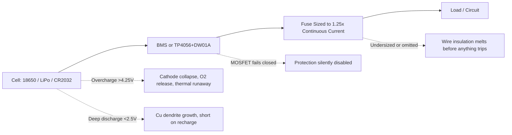
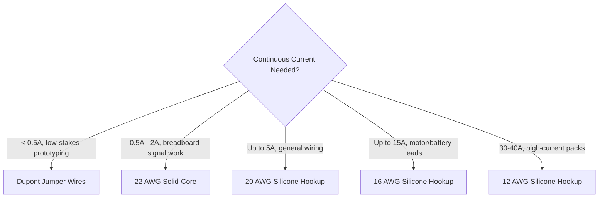

# ⚡ Power, Wiring & Battery Reference

Wire and batteries are the components most likely to fail silently, then fail catastrophically. This reference covers the theory, hard engineering limits, failure modes, and approximate Indian pricing for interconnect and power components, from a breadboard jumper to a multi-cell BMS.

## 📑 Table of Contents

1. [The Protection Stack](#1-the-protection-stack)
2. [Interconnect Wires & Cabling](#2-interconnect-wires--cabling)
3. [Primary Cells (Non-Rechargeable)](#3-primary-cells-non-rechargeable)
4. [Secondary Rechargeable Lithium Cells](#4-secondary-rechargeable-lithium-cells)
5. [Charging & Protection Electronics](#5-charging--protection-electronics)
6. [Overcurrent & Hardware Protection](#6-overcurrent--hardware-protection)
7. [Minimum Viable Power Kit](#7-minimum-viable-power-kit)

## 1. The Protection Stack

Every lithium power system should be read as a stack, not a single part. A cell with no BMS and no fuse is not "simpler" it's a system with two of its three protection layers missing.

> **Rule of thumb:** If you can't answer "what stops this cell from over-charging, over-discharging, and short-circuiting" in one sentence each, the protection stack is incomplete not simplified.

[⬆ Back to top](#-table-of-contents)

## 2. Interconnect Wires & Cabling

Choose gauge by continuous current, not by what's already on the bench.

| Wire Type | Theory & Limits | Failure Modes | Approx. Price (₹) |
|---|---|---|---|
| Flexible Jumper Wires (Dupont, 10/20cm) | 26–28 AWG stranded tinned copper, 0.1" (2.54mm) housing. High contact resistance (≈100–300 mΩ/pin) and high stray inductance (~1 nH/mm). Current limit strictly < 0.5A continuous. | Pin detachment under fatigue; voltage drops on high-current rails causing erratic MCU brownouts. | ₹60 – ₹120 (pack of 40) |
| Solid-Core Wire (22 AWG) | Single 0.326 mm² solid tinned copper, PVC insulation. Low contact resistance (< 30 mΩ), seats firmly in breadboard spring contacts. Up to 1.5–2A continuous in open air. | Metal fatigue snapping inside breadboard tie-points after repeated bending. | ₹150 – ₹300 (10–15m spool) |
| Hookup Wire (Silicone Insulated, Stranded) | Multi-strand tinned copper, 18–20 AWG (general electronics) to 12–16 AWG (motor/battery packs), silicone jacket rated 150–200°C. Continuous limits: 20 AWG ≈ 5A, 16 AWG ≈ 15A, 12 AWG ≈ 30–40A. | Insufficient crimping/soldering at high-current terminals → localized I²R heating and melted connectors. | ₹200 – ₹450 (5m dual-color spool) |

[⬆ Back to top](#-table-of-contents)

## 3. Primary Cells (Non-Rechargeable)

| Cell | Theory & Limits | Failure Modes | Approx. Price (₹) |
|---|---|---|---|
| CR2032 Lithium Coin Cell | Li/MnO₂ chemistry. Nominal 3.0V (fresh 3.3V, cutoff 2.0V), ≈210–240mAh at low draw (0.2mA). High internal resistance (Rint ≈ 10–30Ω) causes significant voltage drop under pulsed loads: ΔV = Ipulse × Rint. | **Never attempt to recharge.** Forces metallic lithium plating on the cathode → internal short-circuits, thermal expansion, cell rupture. | ₹20 – ₹50 per cell |

[⬆ Back to top](#-table-of-contents)

## 4. Secondary Rechargeable Lithium Cells

| Cell | Theory & Limits | Failure Modes | Approx. Price (₹) |
|---|---|---|---|
| 18650 Cylindrical Li-ion (NMC/LCO) | Steel-encased, 3.7V nominal (4.2V max, 2.5–2.8V cutoff). Capacities 2000–3500mAh. Standard continuous discharge 1C–3C (2A–10A); high-drain variants (e.g. Samsung 25R) reach 10C (25A). | Overcharge (>4.25V) collapses the cathode, releases O₂ → thermal runaway. Deep discharge (<2.5V) dissolves copper current collectors → dendrite short on recharge. | ₹80 – ₹250 per cell (brand and discharge rating dependent) |
| LiPo Flat Pouch Pack | Flexible aluminum-laminated pouch, 3.7V nominal single-cell (1S) or series packs (2S=7.4V, 3S=11.1V). Extreme C-ratings (20C–100C+) allow Imax = C-rating × CAh. | Mechanical puncture or internal short → gas generation (puffing), pouch rupture, oxygen-fueled fire. **Never puncture, throw, or use a swollen pack.** | ₹250 – ₹1,200+ (varies by 1S–3S capacity and C-rating) |

[⬆ Back to top](#-table-of-contents)

## 5. Charging & Protection Electronics

| Item | Theory & Limits | Failure Modes | Approx. Price (₹) |
|---|---|---|---|
| TP4056 Linear Charger Module (with DW01A protection) | CC/CV linear charge controller for single-cell (1S) 3.7V Li-ion. Powered via 5V USB, programmable up to 1A charge current. Onboard DW01A + dual 8205A MOSFETs cut off at overcharge (4.3V), over-discharge (2.4V), overcurrent (~3A). | Thermal throttling or IC burn-out dissipating high power at high ambient temperature: Pd = (Vin − Vbat) × Icharge. | ₹25 – ₹50 per module |
| Multi-Cell BMS (2S / 3S / 4S) | Back-to-back high-power MOSFETs controlled by per-cell monitoring ICs. Provides OVP, UVP, SCP (µs-range), and passive cell balancing via bleed resistors (Rbleed ≈ 39–100Ω, ~50mA balancing drain). | MOSFETs failing **closed** under continuous short-circuit stress → protective isolation silently disabled. | ₹60 – ₹250 (depends on cell count and current rating: 10A–40A) |

[⬆ Back to top](#-table-of-contents)

## 6. Overcurrent & Hardware Protection

| Item | Theory & Limits | Failure Modes | Approx. Price (₹) |
|---|---|---|---|
| Automotive Blade Fuses & Inline Holders (Mini/ATO) | Sacrificial thermal link, blows under overcurrent before wire insulation melts. Rated up to 32V DC, Interrupt Rating (AIC) ~1000A. Sizing rule: Ifuse = 1.25 × Icont. | Arcing across blown contacts if deployed beyond 32V DC or beyond the fuse's short-circuit interrupt rating (>1000A). | ₹30 – ₹80 (holder + fuse kit) |

[⬆ Back to top](#-table-of-contents)

## 7. Minimum Viable Power Kit

- [ ] 22 AWG solid-core spool for breadboard work, 20 AWG silicone hookup for anything drawing real current
- [ ] Never rely on Dupont jumpers past 0.5A continuous
- [ ] One TP4056 module per single-cell Li-ion/LiPo project no exceptions, even "just for testing"
- [ ] A sized BMS for any multi-cell (2S+) pack, matched to actual continuous current draw
- [ ] A fuse sized at 1.25× continuous current on every battery-powered high-current circuit
- [ ] Visual pack inspection before every charge cycle: no puffing, no punctures, no exposed foil
- [ ] Never recharge a CR2032 or any primary cell, under any circumstance

[⬆ Back to top](#-table-of-contents)
