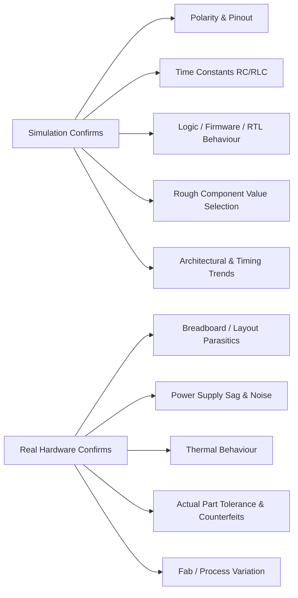
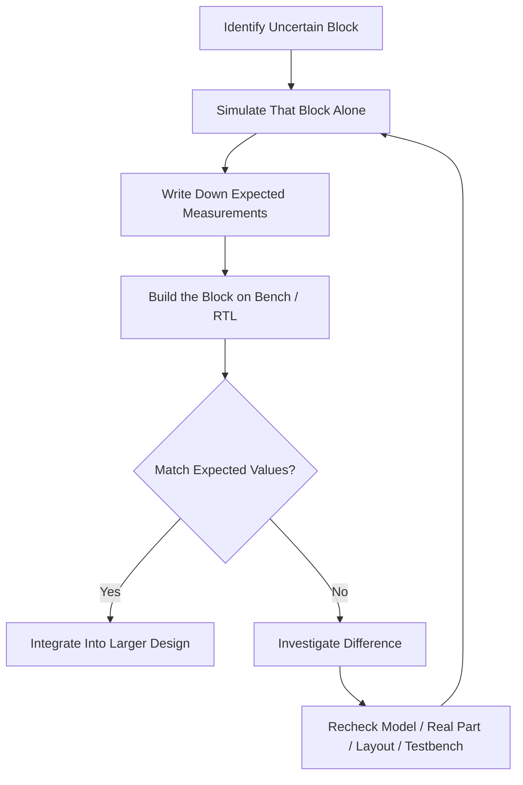

# 🔬 Simulations for learning

Simulation is useful for checking an idea, finding a wrong polarity, estimating a time constant, and exploring values before buying parts. It does not prove that a breadboard layout, power supply, thermal design, or physical component will work.

## 📑 Table of Contents

1. [What Simulation Can and Cannot Tell You](#1-what-simulation-can-and-cannot-tell-you)
2. [Choosing a Simulator by Domain](#2-choosing-a-simulator-by-domain)
   - [Domain 0–5: Basic Circuits, Embedded & UI](#domain-05-basic-circuits-embedded--ui)
   - [Domain 2 & 11: Analog, Mixed-Signal & SPICE](#domain-2--11-analog-mixed-signal--spice)
   - [Domain 8: Digital Logic, FPGA & RTL Verification](#domain-8-digital-logic-fpga--rtl-verification)
   - [Domain 9: Computer Architecture & SoC](#domain-9-computer-architecture--soc)
   - [Domain 10 & 12: VLSI, ASIC Design & Device Physics](#domain-10--12-vlsi-asic-design--device-physics)
   - [Academic, Virtual Labs & Learning Resources](#academic-virtual-labs--learning-resources)
3. [The Simulation Workflow](#3-the-simulation-workflow)
4. [Simulate → Build → Compare](#4-simulate--build--compare)
5. [Minimum Viable Simulation Checklist](#5-minimum-viable-simulation-checklist)

## 1. What Simulation Can and Cannot Tell You

Treat a simulator as a fast, cheap way to catch logic and math errors before they cost you a part or a burnt trace not as a certification that the circuit will work on the bench.

* **What simulation confirms:** polarity, rough time constants, logic/firmware/RTL behaviour, and whether a component value or architectural choice is in the right ballpark.
* **What simulation cannot confirm:** breadboard parasitics, real power-supply sag under load, thermal drift, whether the physical part you bought is genuine and within spec, or how a design behaves after an actual tape-out.

[⬆ Back to top](#-table-of-contents)

## 2. Choosing a Simulator by Domain

Different simulators are strong at different layers of a project, from a blinking LED to an ASIC tape-out. Pick based on what you're actually trying to verify, not by habit. Domains correspond to rising complexity, not difficulty — you can jump straight to Domain 8 without ever touching Domain 0.

### Domain 0–5: Basic Circuits, Embedded & UI

| Tool | Access / OS | Best For | Notes |
|---|---|---|---|
| [Wokwi](https://wokwi.com/) | Online, OS independent | Arduino, ESP32, STM32, Raspberry Pi Pico projects | Excellent for testing RTOS tasks and custom I2C/SPI peripherals before flashing hardware. |
| [Tinkercad Circuits](https://www.tinkercad.com/circuits) | Online, OS independent | First-time circuit and Arduino simulation | Approachable, visual, aimed at absolute beginners. |
| [Falstad Circuit Simulator](https://www.falstad.com/circuit/) | Online & downloaded, OS independent (Java/HTML5) | Animated intuition for RC, RLC, diode, transistor circuits | Highly visual for understanding current flow in real time. |
| [Zephyr RTOS (native_sim)](https://docs.zephyrproject.org/latest/boards/native/native_sim/doc/index.html) | Downloaded; Linux, macOS, Windows (WSL) | Running embedded firmware as a native host executable | Essential for testing RTOS tasks, Bluetooth stacks, and state machines without hardware. |
| [LVGL PC Simulator](https://docs.lvgl.io/master/integration/pc/index.html) | Downloaded; Windows, macOS, Linux | Embedded graphics/UI development | Uses SDL to design and debug MCU UI layouts on desktop before flashing. |
| [EasyEDA](https://easyeda.com/) | Online & downloaded; Windows, macOS, Linux | Schematic and PCB design | Use *after* circuit behaviour is understood not as a replacement for reading datasheets. |
| [Fritzing](https://fritzing.org/) | Downloaded; Windows, macOS, Linux | Mapping breadboard prototypes to schematics | Useful for visually documenting a physical build. |

### Domain 2 & 11: Analog, Mixed-Signal & SPICE

| Tool | Access / OS | Best For | Notes |
|---|---|---|---|
| [LTspice](https://www.analog.com/en/design-center/design-tools-and-calculators/ltspice-simulator.html) | Downloaded; Windows, macOS, Linux (Wine) | Switching regulators, active filters, amplifier design | The industry-standard SPICE simulator; extremely fast. |
| [eSim (FOSSEE)](https://esim.fossee.in/) | Downloaded; Windows, Linux | General SPICE-based circuit simulation | Open-source, built on Ngspice; heavily used in the Indian engineering curriculum. Best run containerized via Docker on Linux. |
| [Ngspice](https://ngspice.sourceforge.io/) | Downloaded; Windows, macOS, Linux | Mixed-level / mixed-signal circuit simulation | The premier open-source SPICE engine underlying several GUI tools. |
| [Qucs-S](https://ra3xdh.github.io/) | Downloaded; Windows, macOS, Linux | Graphical schematic capture with Ngspice/XYCE backend | Good middle ground between raw SPICE and a full GUI suite. |
| [CircuitLab](https://www.circuitlab.com/) | Online, OS independent | Quickly sketching analog blocks | Browser-based mixed-signal simulator. |

### Domain 8: Digital Logic, FPGA & RTL Verification

| Tool | Access / OS | Best For | Notes |
|---|---|---|---|
| [EDA Playground](https://www.edaplayground.com/) | Online, OS independent | Verilog, SystemVerilog, VHDL without local toolchains | Fastest way to try RTL snippets in a browser. |
| [Verilator](https://www.veripool.org/verilator/) | Downloaded; Linux, macOS, Windows (WSL) | Fast open-source Verilog simulation | Compiles Verilog into C++ models; ideal for pairing with software testbenches. |
| [Cocotb](https://www.cocotb.org/) | Downloaded; Windows, macOS, Linux | Writing RTL testbenches in Python instead of SystemVerilog | Coroutine-based cosimulation library; pairs well with Icarus Verilog or Verilator. |
| [Icarus Verilog (iverilog)](https://steveicarus.github.io/iverilog/) | Downloaded; Windows, macOS, Linux | Offline synthesis and simulation of logic | The standard open-source Verilog toolchain. |
| [GTKWave](https://gtkwave.sourceforge.net/) | Downloaded; Windows, macOS, Linux | Reading VCD files, debugging timing diagrams | Companion waveform viewer for the tools above. |
| [Digital](https://github.com/hneemann/Digital) | Downloaded; Windows, macOS, Linux (Java) | Drawing logic gates visually | Auto-exports designs to Verilog or VHDL. |

### Domain 9: Computer Architecture & SoC

| Tool | Access / OS | Best For | Notes |
|---|---|---|---|
| [Gem5](https://www.gem5.org/) | Downloaded; Linux, macOS, Windows (WSL) | Computer system architecture research | Highly accurate, modular; simulates full memory hierarchies and multi-core SoCs at cycle level. |
| [Renode](https://renode.io/) | Downloaded; Windows, macOS, Linux | Simulating physical hardware systems and multi-node IoT networks | Open-source framework, used heavily alongside Zephyr for complex SoCs. |
| [QEMU](https://www.qemu.org/) | Downloaded; Windows, macOS, Linux | Generic machine emulation and virtualization | Good for testing bootloaders or embedded OS images (ARM, RISC-V). |
| [Ripes](https://github.com/mortbopet/Ripes) | Downloaded; Windows, macOS, Linux | Visualizing RISC-V datapaths, pipelines, caches | Visual simulator and assembly editor. |
| [Logisim-Evolution](https://github.com/logisim-evolution/logisim-evolution) | Downloaded; Windows, macOS, Linux (Java) | Designing complex digital logic circuits | Educational tool with FPGA board support. |

### Domain 10 & 12: VLSI, ASIC Design & Device Physics

| Tool | Access / OS | Best For | Notes |
|---|---|---|---|
| [OpenLane](https://github.com/The-OpenROAD-Project/OpenLane) | Downloaded; Linux, macOS, Windows (Docker/WSL) | Automated RTL-to-GDSII flow | Works with the SkyWater 130nm PDK; best run containerized. |
| [Yosys](https://yosyshq.net/yosys/) | Downloaded; Windows, macOS, Linux | RTL synthesis | Foundational open-source framework converting Verilog into gate-level netlists. |
| [Magic VLSI](http://opencircuitdesign.com/magic/) | Downloaded; Linux, macOS, Windows (WSL) | Manual layout drawing and design-rule checking | Open-source VLSI layout tool. |
| [KLayout](https://www.klayout.de/) | Downloaded; Windows, macOS, Linux | Viewing/editing GDSII and OASIS files | High-performance viewer, useful for tape-out inspection. |
| [Netgen](http://opencircuitdesign.com/netgen/) | Downloaded; Linux, macOS | Layout Versus Schematic (LVS) comparison | Open-source LVS tool, typically paired with Magic. |

### Academic, Virtual Labs & Learning Resources

| Resource | Access | Best For | Notes |
|---|---|---|---|
| [HDLBits](https://hdlbits.01xz.net/wiki/Main_Page) | Online | Interactive Verilog practice | Gives small design problems and instantly simulates your code against a testbench. |
| [Nand2Tetris](https://www.nand2tetris.org/) | Online / downloaded | Building a computer from NAND gates up | Project-based course ending in a working CPU and OS. |
| [ASIC-World](http://www.asic-world.com/) | Online | Verilog/SystemVerilog/digital design reference | One of the oldest, most comprehensive free references available. |
| [ChipVerify](https://www.chipverify.com/) | Online | Verilog, SystemVerilog, UVM tutorials | Modern, well-maintained verification-focused tutorials. |
| [VLab (Ministry of Education, India)](https://www.vlab.co.in/) | Online | Basic electrical circuits, DSP, digital logic labs | Interactive virtual laboratory exercises. |
| [VLab VLSI (IIT Guwahati)](https://vlsi-iitg.vlabs.ac.in/) | Online | VLSI design rules, SPICE modeling, inverter characteristics | Focused virtual lab modules for VLSI fundamentals. |
| [NanoHub](https://nanohub.org/) | Online | Semiconductor device physics, nanoelectronics | Hosted by Purdue University; browser-based simulation tools. |
| [OpenFASoC](https://github.com/idea-fasoc/OpenFASoC) | Downloaded | Automated analog/mixed-signal generation | Focused on generators for blocks like ADCs and PLLs. |

[⬆ Back to top](#-table-of-contents)

## 3. The Simulation Workflow

For a complicated circuit or design, don't simulate the whole thing at once isolate the smallest block you're actually unsure about.

* **Identify the uncertain block:** a timing network, a level shifter, a gain stage, a state machine, or a single RTL module anything you can't predict by hand.
* **Simulate it in isolation:** don't drag in the whole schematic or full design; noise from unrelated blocks makes results harder to trust.
* **Write down expected measurements:** exact voltages, rise times, logic levels, or waveform behaviour *before* you touch the breadboard or synthesize, not after.

[⬆ Back to top](#-table-of-contents)

## 4. Simulate → Build → Compare

Once you have expected numbers on paper, build the block and measure it for real (or run it against a real testbench). The gap between simulated and measured values is where the useful information lives.

| Step | Action | What to Watch For |
|---|---|---|
| 1. Simulate | Model the uncertain block only | Record expected voltage/current/timing/logic values |
| 2. Build | Reproduce the same block on breadboard, bench, or in RTL/hardware | Use the same component values or design parameters as the sim, not "close enough" substitutes |
| 3. Measure | Probe the same nodes, signals, or waveforms the simulator reported | Match measurement points to simulated nodes exactly |
| 4. Compare | Check measured vs. expected | Small deltas are normal (tolerances, parasitics, process variation); large deltas are not |
| 5. Investigate | If the difference is large, stop | Don't keep adding parts or modules on top of an unexplained mismatch |

> **Rule of thumb:** Investigate any large difference before adding more parts. A circuit or design that disagrees with its own simulation at the first stage will only get harder to debug once it's buried under the next three stages.

[⬆ Back to top](#-table-of-contents)

## 5. Minimum Viable Simulation Checklist

- [ ] Identified the single smallest uncertain block in the circuit or design
- [ ] Picked the right tool for the domain of the problem (basic circuit, SPICE, RTL, architecture, or VLSI)
- [ ] Simulated that block in isolation (not the full schematic or full design)
- [ ] Recorded expected voltages/timing/logic levels before building
- [ ] Used the same component values or design parameters in the real build as in the sim
- [ ] Measured the same nodes or signals reported by the simulator
- [ ] Compared measured vs. expected and flagged any large deltas
- [ ] Investigated mismatches before integrating the block into the larger circuit or design

[⬆ Back to top](#-table-of-contents)
