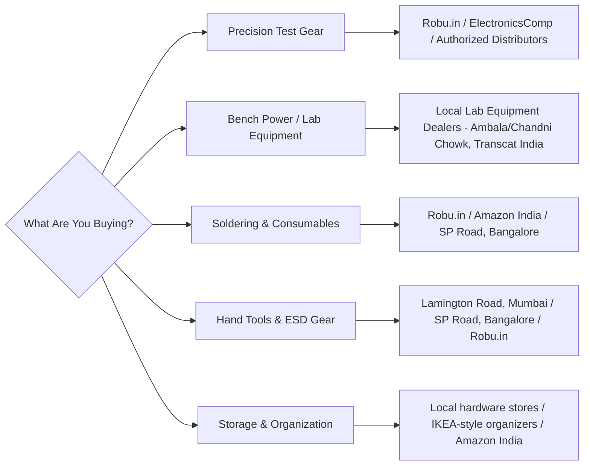
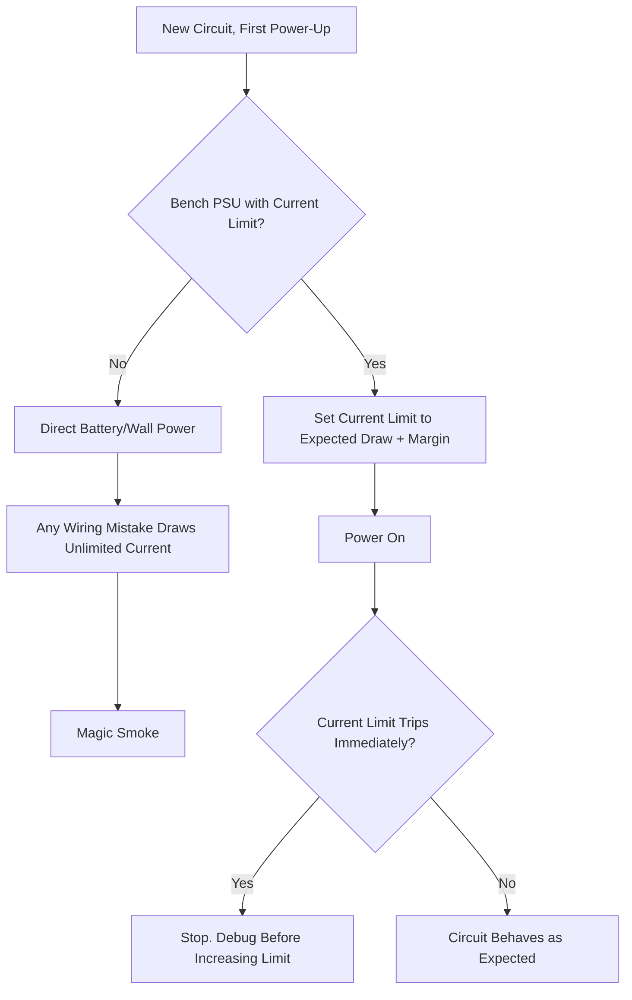

# The Electronics Workbench

Specific tools, local pricing, procurement routes, and the reasoning behind each pick. A bench built from a random general-marketplace search accumulates tools that look right and measure wrong. Avoid unverified generic listings. Source from specialized Indian tool sellers and component distributors instead: Robu, Mouser India, ElectronicsComp, or the SP Road (Bangalore) and Lamington Road (Mumbai) hardware markets, plus dedicated test-gear importers for anything calibration-sensitive.

## 📑 Table of Contents

1. [Sourcing by Category](#1-sourcing-by-category)
2. [Measurement & Signal Analysis](#2-measurement--signal-analysis)
3. [Power & Sourcing](#3-power--sourcing)
4. [Soldering & Rework Bench](#4-soldering--rework-bench)
5. [Hand Tools & Precision Mechanics](#5-hand-tools--precision-mechanics)
6. [Safety, Work Surfaces & ESD Control](#6-safety-work-surfaces--esd-control)
7. [Storage, Labeling & Bench Organization](#7-storage-labeling--bench-organization)
8. [Calibration & Verification](#8-calibration--verification)
9. [Documentation: The Lab Notebook](#9-documentation-the-lab-notebook)
10. [Common Bench Failure Modes](#10-common-bench-failure-modes)
11. [Minimum Viable Bench Checklist](#11-minimum-viable-bench-checklist)

## 1. Sourcing by Category

Different tool categories genuinely live in different supply chains in India. Match the purchase to the right one rather than defaulting to whatever a general marketplace search turns up. A DMM and a bench PSU are not bought the same way, and treating them as if they are is how people end up with uncalibrated "lab equipment" that quietly reports the wrong number for years.

* **Precision test gear** (DMMs, scopes, logic analyzers) benefits from a paper trail; authorized distributors and known importers can be pushed on warranty and calibration certificates. A random marketplace seller cannot.
* **Bench power / lab equipment** is often cheaper and better supported through old-school scientific/electrical markets than through e-commerce, because these dealers also stock spares and can repair a blown supply.
* **Soldering & consumables** are commodity items price-shop freely here; brand matters far less than checking the solder's actual alloy ratio and the flux's residue type.
* **Hand tools & ESD gear** vary enormously in real-world durability at the same price point; buying from a specialist market where you can physically test a plier's action beats a stock photo.

[⬆ Back to top](#-table-of-contents)

## 2. Measurement & Signal Analysis

Measurement tools are the one category where "buy the wrong thing and it seems to work" is the most dangerous failure mode. A miscalibrated meter does not announce itself; it just quietly reports numbers you trust.

| Tool | What to Buy | Where | Notes |
|---|---|---|---|
| Digital Multimeter (DMM) | **UNI-T UT61E+** (True RMS, high count) or budget **Aneng AN8008 / Fluke 101** | Robu.in, ElectronicsComp, or local electrical markets | Mandatory for Levels 0+. Buy this before anything else on the list. True RMS matters the moment you measure anything non-sinusoidal (PWM, switching supplies). |
| Oscilloscope | **Siglent SDS1104X-E** or **OWON SDS1022** (2-channel, 100MHz digital storage) | Transcat India, Test Instrument India, or authorized distributors | Necessary from Level 2 (Analog) onward. Entry-level digital scopes run ₹25,000–₹40,000. Bandwidth matters more than channel count for most hobbyist signals; don't overspend on 4 channels before you need them. |
| Logic Analyzer | **Saleae Logic 8 clone** (CY7C68013A, 8-channel, 24MHz USB) | Robu or Amazon India, ~₹500–₹800 | Crucial for Level 7 (Interfaces) I2C/SPI/UART debugging. Pairs with open-source PulseView (Sigrok). A clone is genuinely fine here the value is in the software stack, not the silicon. |
| LCR Meter | Basic handheld LCR meter, or a DIY transistor/component tester module | Robu.in, ElectronicsComp | Verifies salvaged passives and checks capacitor ESR before reuse; catches a "resistor" that's actually drifted 20% out of spec. |
| Bench-Grade Frequency Counter (optional) | Any 10MHz+ handheld or bench counter | Local test-gear dealers | Only worth adding once you're doing RF or precision timing work; a scope's built-in measurement is close enough until then. |
| IR Thermometer / Thermal Camera | Budget IR thermometer gun, or a FLIR-based thermal camera for advanced work | Robu.in, Amazon India | Spots a silently overheating regulator or a solder joint with a hidden short before it becomes visible smoke. |

> **On "True RMS":** A non-True-RMS meter reads sine waves correctly but lies on anything else: PWM outputs, switching supply ripple, motor drive waveforms. If your bench touches any of that, the ₹200 price difference between a basic and a True RMS meter is not optional.

[⬆ Back to top](#-table-of-contents)

## 3. Power & Sourcing

A bench without a current-limited supply is a bench where every new circuit's first power-up is a gamble.

| Tool | What to Buy | Where | Notes |
|---|---|---|---|
| Bench Power Supply (DC PSU) | **KORAD KD3005P** or **Mastech HY3005D** (0–30V, 0–5A adjustable, digital display, coarse/fine tuning) | Local lab equipment dealers (Ambala/Chandni Chowk scientific markets, Delhi) or specialized test-gear portals online | Required to current-limit a circuit before you ever apply power to it for real. The current-limit knob alone prevents the majority of first-power-up failures. |
| USB Power Monitor | **KWS-MX18** or a USB Type-C power meter | Robu.in, Amazon India | Tracks real-time current draw, voltage drop, and mAh on boards like the ESP32 essential for battery-life debugging and catching a board that draws more current than its datasheet claims. |
| Secondary/Backup Linear Supply | Any fixed 5V/12V linear wall adapter, 1–2A | Local electronics markets | Keep one dedicated to "known good" power for sanity-checking whether a fault is in your circuit or your bench PSU. |
| Electronic Load (optional, advanced) | DIY or budget electronic load module | Robu.in, specialty importers | Useful once you're characterizing your own power supplies (LDOs, buck/boost converters) rather than just powering other circuits. |

[⬆ Back to top](#-table-of-contents)

## 4. Soldering & Rework Bench

### Iron & Rework Tiers

| Tier | What to Buy | Approx. Price | Notes |
|---|---|---|---|
| Gold standard | **Hakko FX-951** or **JBC** stations | ₹30,000+ | Professional-grade, rapid thermal recovery for frequent/production use. Justify this tier only once you're soldering daily or professionally. |
| Indian hobbyist / prosumer standard | **Kada 852D+** (soldering + hot air rework combo) | ₹3,500 – ₹5,000 | Great for SMD chips; the realistic sweet spot for most home benches, combines an iron and hot air gun in one unit. |
| Portable smart iron | **TS100 / TS120 / Pinecil V2** | Varies (~₹2,000–₹4,000) | USB-C PD powered; extremely popular among Indian makers for portability. Good second iron for fieldwork or a travel kit. |
| Dedicated hot air station (if not bundled) | **Quick 861DW** or **Hakko FR-810** | ₹6,000 – ₹15,000 | Needed for SMD rework and desoldering multi-pin ICs once the bundled 852D+ airflow isn't enough. |

### Consumables

| Item | What to Buy | Notes |
|---|---|---|
| Solder wire | Multicore or Alpha 63/37 Sn/Pb (leaded), 0.8mm, 50g–250g spool | Leaded solder melts at a lower temperature, reducing heat stress on delicate PCB traces and pads. Keep a lead-free spool separately if you ever need RoHS-compliant work. |
| Flux | Amtech NC-559-ASM, or RMA rosin flux pen/paste | For clean surface-mount soldering; no-clean liquid flux reduces bridging on fine-pitch parts. |
| Desoldering | Engineer SS-02 desoldering pump (silicone tip) + GOOT Wick 30mm | SS-02 is the gold-standard manual pump; keep wick on hand for fine SMD pads. A desoldering gun is a later upgrade, not a starting requirement. |
| Tip care | Tip tinner/cleaner, brass wool tip cleaner | Iron tips oxidize and stop transferring heat properly long before they look obviously worn; clean and tin before every session, not just when soldering feels harder. |
| Fume extraction | DIY fan + carbon filter, or a dedicated benchtop extractor | Protects lungs during long sessions. Do not skip this, especially with leaded solder and flux fumes in a closed room. |

[⬆ Back to top](#-table-of-contents)

## 5. Hand Tools & Precision Mechanics

| Category | What to Buy | Notes |
|---|---|---|
| Pliers & cutters | Engineer NS-04 or Iroda flush cutters (ESD safe) | Avoid cheap ₹50 cutters; they blunt after cutting two steel component pins. A good flush cutter should still cut cleanly after months of use. |
| Tweezers | Vetus ESD-10 (straight), ESD-11 (curved), ESD-15 (fine curved) | For handling SMD resistors, capacitors, and IC packages without static or slip damage. Keep at least one straight and one curved pair. |
| Precision screwdrivers | Wiha PicoFinish or Xiaomi Wiha 24-in-1 set | For terminal blocks, enclosures, and general assembly; a cheap magnetized-tip set that slips is worse than no screwdriver at all on a small screw. |
| Wire strippers | Adjustable automatic wire stripper, or a fixed-gauge manual stripper for your most common wire size | A stripper that nicks the copper strands creates a hidden weak point that fails later under vibration, not immediately. |
| Holding & magnification | Weighted "helping hands" with alligator clips, PCB vise, third-hand magnifier with LED ring light | Frees both hands for soldering; a magnifier ring light matters more than most people expect once you're working under 0603 scale. |
| Hemostats | Curved and straight hemostat pairs | Useful beyond tweezers for clamping wires as heat sinks during soldering, or holding small parts steady under a magnifier. |

[⬆ Back to top](#-table-of-contents)

## 6. Safety, Work Surfaces & ESD Control

| Surface | Purpose | ESD Safe? | Notes |
|---|---|---|---|
| Silicone soldering mat | Heat-resistant work surface, often with a magnetic grid for tiny screws/IC pins | No | Fine for general hobbyist soldering with no bare-die ICs on the bench. |
| True ESD anti-static mat | Dual-layer dissipative rubber mat, connected to a 1MΩ ground cord and grounded wrist strap | Yes only when actually grounded | Mandatory once bare ICs, FPGAs, or motherboards are involved. |
| Wrist strap | Adjustable conductive strap with a coiled ground cord | Yes when worn and connected | Check continuity with a multimeter occasionally; straps do wear out and stop working invisibly. |
| Fire safety | A small CO2 or dry-powder extinguisher rated for electrical fires, kept within arm's reach | N/A | Especially important anywhere lithium cells are charged or tested unattended charging is the highest-risk habit on most hobbyist benches. |

> **Crucial warning:** A standard silicone mat does **not** protect against electrostatic discharge. If you are handling bare ICs, FPGAs, or repairing motherboards, use a true dissipative ESD mat tied to earth ground, with a wrist strap. Skipping this step does not save time. It just moves the failure to a later, harder-to-diagnose point, often as an intermittent fault that only shows up weeks after assembly.

[⬆ Back to top](#-table-of-contents)

## 7. Storage, Labeling & Bench Organization

A bench with unlabeled bins is a bench where every project starts with twenty minutes of searching.

| System | What to Use | Notes |
|---|---|---|
| Small passives (R/C) | Multi-compartment organizer boxes, one box per component type | Label every compartment with value *and* tolerance; "10k" without a tolerance is not enough information once you're chasing a precision issue. |
| ICs & modules | Anti-static bags, stored in a labeled bin or drawer, ideally by function (logic, power, comms) | Keep the original packaging or datasheet reference with the part until it's used; loose ICs without markings become mystery parts fast. |
| Wire & spools | A spool rack or pegboard, sorted by gauge | Prevents the "long enough, close enough gauge" temptation that leads to undersized wiring on a real load. |
| Reference material | A physical or digital binder of datasheets for every part currently in stock | Cheaper than re-downloading a datasheet mid-debug at 11pm; keep a local copy, not just a bookmark. |
| Label maker or masking tape | Any basic label maker, or masking tape + permanent marker | The lowest-cost, highest-leverage organization tool on this entire list. |

[⬆ Back to top](#-table-of-contents)

## 8. Calibration & Verification

Buying good tools is half the job; knowing they still read correctly is the other half.

| Check | How Often | Method |
|---|---|---|
| DMM accuracy | Every 6–12 months, or after a drop | Compare against a known reference resistor/voltage source, or cross-check two meters against each other on the same measurement. |
| Bench PSU voltage/current accuracy | Every 6–12 months | Measure PSU output with your (separately verified) DMM at a few set points across its range. |
| Oscilloscope probe compensation | Every time a probe is moved to a new channel | Use the scope's built-in square-wave calibration output and adjust the probe's trim capacitor until the square wave is flat-topped. |
| Wrist strap / ESD mat continuity | Monthly, or before any sensitive IC work | A basic wrist-strap tester, or a multimeter continuity check from strap to a known ground point. |
| Fume extractor filter | Per manufacturer schedule, or when you notice a smell | A saturated carbon filter stops protecting you long before it looks visibly dirty. |

[⬆ Back to top](#-table-of-contents)

## 9. Documentation: The Lab Notebook

The most under-bought "tool" on any bench is a place to write down what you actually did.

* **Record, for every non-trivial circuit:** the component values used, expected measurements (see the [simulation guide](simulation.md)'s simulate → build → compare workflow), and what you actually measured.
* **Log bench PSU settings** (voltage, current limit) at the moment a circuit failed this is the single most useful piece of information for diagnosing a later repeat failure.
* **Track calibration dates** from [section 8](#8-calibration--verification) in the same notebook, not a separate system you'll forget to check.
* **Physical or digital both work** the requirement is consistency, not format. A notebook you actually update beats a beautifully organized system you abandon after two weeks.

[⬆ Back to top](#-table-of-contents)

## 10. Common Bench Failure Modes

Problems that look like a bad component but are actually a bad bench habit.

| Symptom | Likely Real Cause | Fix |
|---|---|---|
| "Random" intermittent faults that vanish when probed | Cold solder joint, or an unlabeled/ungrounded ESD event that damaged a part without killing it outright | Reflow suspect joints; verify ESD grounding was actually in place during assembly. |
| Multimeter readings that "don't make sense" | Meter set to the wrong function/range, or a dying/uncalibrated meter | Re-check function/range first; cross-verify with a second meter before assuming the circuit is at fault. |
| A regulator or MOSFET runs hot for "no reason" | Missing or undersized current limit on the bench PSU during first power-up, masking a wiring fault until real load is applied | Always bring a new circuit up through a current-limited supply first; investigate any current draw above the expected value before removing the limit. |
| A part that "worked yesterday" doesn't today | Static damage from handling without ESD protection, or a marginal solder joint finally failing under thermal cycling | Treat repeat "it just died" events as an ESD or workmanship signal, not bad luck run through the checks in [section 6](#6-safety-work-surfaces--esd-control) before reordering the part. |
| Oscilloscope shows a signal that looks "noisier" than expected | Uncompensated probe, or missing ground clip on a high-frequency signal | Recheck probe compensation ([section 8](#8-calibration--verification)) and use the shortest possible ground lead. |

[⬆ Back to top](#-table-of-contents)

## 11. Minimum Viable Bench Checklist

- [ ] A True-RMS or budget DMM (UT61E+ / AN8008 / Fluke 101)
- [ ] A logic analyzer clone before you need one for Level 7 interfacing work
- [ ] A current-limited bench PSU before powering any new circuit for the first time
- [ ] A temperature-controlled iron (Kada 852D+ or a TS100/Pinecil-class portable) plus leaded solder and flux
- [ ] An SS-02 pump and desoldering wick before your first rework mistake, not after
- [ ] ESD-safe flush cutters and Vetus tweezers
- [ ] A grounded ESD mat and wrist strap the moment bare ICs or FPGAs enter the bench
- [ ] An oscilloscope only once you're actually doing Level 2+ analog or timing work
- [ ] Labeled storage for passives, ICs, and wire before the bin pile becomes unmanageable
- [ ] A calibration check schedule for the DMM, PSU, and scope probes
- [ ] A lab notebook, physical or digital, that you actually update after every non-trivial build

[⬆ Back to top](#-table-of-contents)
